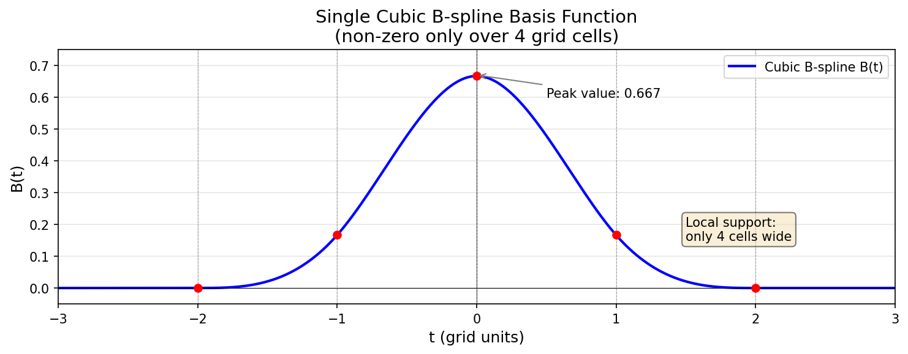
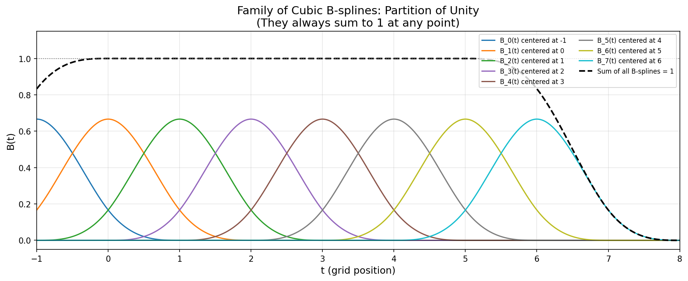
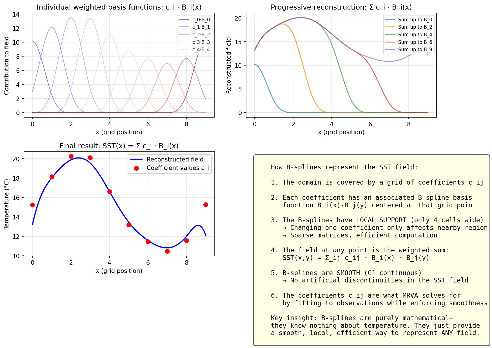
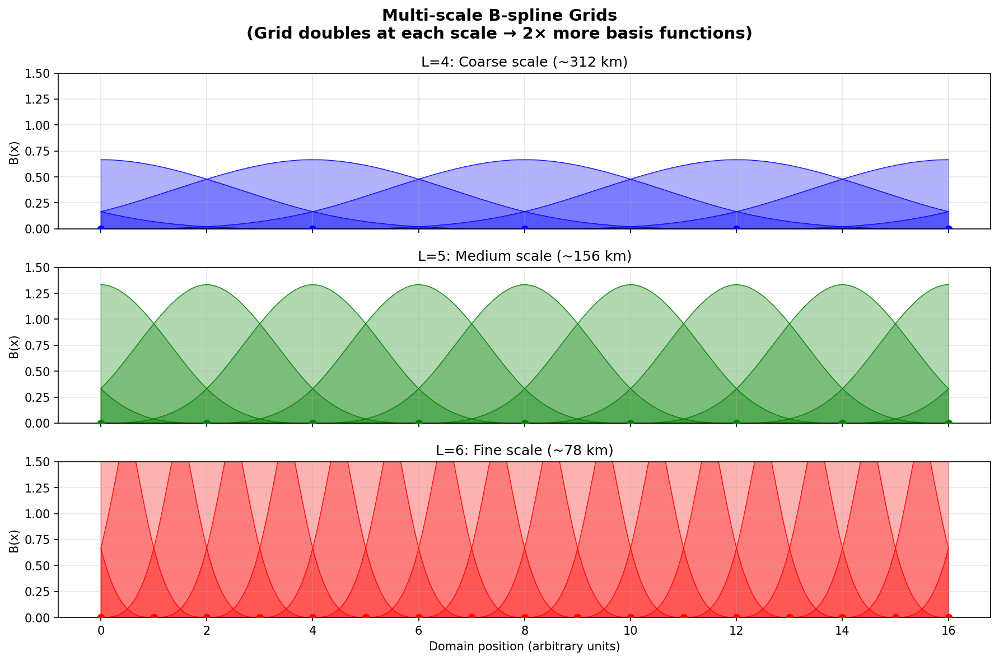
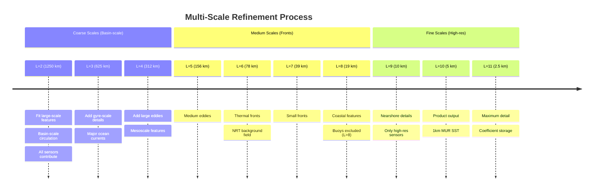

# MUR Algorithm Flow and Processing

## Introduction

This document describes the Multi-Resolution Variational Analysis (MRVA) algorithm used in the MUR SST product. MRVA is a hierarchical data assimilation method that progressively refines SST estimates from coarse to fine spatial scales, optimally combining observations from multiple satellite sensors and in-situ instruments.

## Table of Contents

1. [Algorithm Overview](#algorithm-overview)
2. [B-spline Basis Functions](#b-spline-basis-functions)
3. [Mathematical Formulation](#mathematical-formulation)
4. [Multi-Scale Processing Flow](#multi-scale-processing-flow)
5. [Scale Parameter Interpretation](#scale-parameter-interpretation)
6. [Data Incorporation Strategy](#data-incorporation-strategy)
7. [Temporal Weighting](#temporal-weighting)
8. [Solver Details](#solver-details)
9. [Output Products](#output-products)

## Algorithm Overview

### Conceptual Framework

MRVA solves the SST analysis problem as a **constrained optimization** that balances two competing objectives:

```
Minimize: J = J_data + J_smooth

Where:
  J_data   = weighted sum of squared residuals against observations
  J_smooth = smoothness penalty (thin-plate regularization)
```

The solution is represented using **cubic B-spline basis functions**:

```
SST(x,y) = Σ c_ij * B_i(x) * B_j(y)
```

Where:
- `c_ij` are coefficient values (the unknowns to solve for)
- `B_i(x), B_j(y)` are cubic B-spline basis functions
- The summation is over all grid points at a given scale

### Key Features

1. **Multi-scale hierarchy:** Process from coarse (L=2, ~1250km) to fine scales (L=11, ~2.5km)
2. **Variational formulation:** Optimal balance between data fidelity and smoothness
3. **Spline representation:** Continuous field with local support (smooth interpolation)
4. **Adaptive weighting:** Scale-dependent data influence prevents aliasing
5. **Temporal decay:** Recent observations weighted more heavily
6. **Latitude correction:** Accounts for spherical geometry (anisotropic smoothing)
7. **Multi-sensor fusion:** Combines satellite, in-situ, and ice data

### Why Multi-Scale?

Processing in a coarse-to-fine hierarchy provides several advantages:

- **Computational efficiency:** Solve on coarse grids first (fewer unknowns)
- **Convergence:** Initialize fine scales with coarse-scale solution
- **Physical consistency:** Large-scale features constrain small-scale details
- **Data fusion:** Use coarse sensors at large scales, high-res sensors at fine scales
- **Gap filling:** Coarse scales provide background where fine-scale data is sparse

## B-spline Basis Functions

### What are B-splines?

B-splines are **purely mathematical basis functions**—they have no inherent connection to temperature or ocean physics. They serve the same role as sine/cosine waves in Fourier analysis: providing a flexible set of "building blocks" for representing smooth fields.

The SST field is represented as a weighted sum of these basis functions:

```
SST(x,y) = Σ c_ij · B_i(x) · B_j(y)
```

Where the **coefficients c_ij are the unknowns** we solve for, and the B-splines B_i, B_j are fixed mathematical functions.

### Key Properties

| Property | Description | Benefit for MRVA |
|----------|-------------|------------------|
| **Local support** | Each B-spline is non-zero over only 4 grid cells | Sparse matrices, O(N) computation |
| **Smoothness** | C² continuous (continuous 2nd derivative) | No artificial discontinuities in SST |
| **Partition of unity** | All basis functions sum to 1 at any point | Proper interpolation, unbiased averaging |
| **Non-negative** | Always ≥ 0 | Numerically stable |
| **Tensor product** | 2D basis = B_i(x) · B_j(y) | Separable, efficient computation |

### Single B-spline Basis Function

A cubic B-spline centered at the origin has the piecewise formula:

```
B(t) = (4 - 6|t|² + 3|t|³) / 6    for |t| < 1
B(t) = (2 - |t|)³ / 6              for 1 ≤ |t| < 2
B(t) = 0                           for |t| ≥ 2
```



*A single cubic B-spline: smooth, bell-shaped, and non-zero only over 4 grid cells.*

### Partition of Unity

When B-splines are placed at each grid point, they **always sum to 1** at any location:



*Multiple B-splines covering the domain. The dashed line shows their sum equals 1 everywhere.*

This property ensures that the representation has no gaps or biases—it's a proper weighted average of nearby coefficients.

### Field Reconstruction

The coefficients c_ij determine the SST field. Each coefficient multiplies its associated basis function, and the sum produces the continuous field:



*Top-left: Individual weighted basis functions c_i·B_i(x). Top-right: Progressive summation. Bottom-left: Final reconstructed field (blue) from coefficient values (red points).*

### Multi-Scale B-splines

At each scale L, the grid spacing halves and the number of basis functions doubles:



*B-spline grids at different scales. Finer scales have more, narrower basis functions to capture smaller features.*

This is the "wavelet-like" aspect of MRVA—the hierarchical multi-resolution structure—though the B-splines themselves are **not wavelets** (they don't have zero mean or the strict frequency localization properties of wavelets).

### Why B-splines (not wavelets)?

While MRVA's multi-resolution approach is inspired by wavelet analysis, it uses B-splines rather than true wavelets because:

1. **Non-negativity**: B-splines are always ≥ 0, simplifying physical interpretation
2. **Interpolation**: B-splines naturally interpolate between grid points
3. **Simplicity**: The tensor-product structure B_i(x)·B_j(y) is straightforward
4. **Smoothness**: Cubic B-splines provide C² continuity without oscillations

Wavelets (which oscillate and have zero mean) would require more complex handling for a physical field like SST that is inherently positive and smooth.

## Mathematical Formulation

### Variational Problem

At each scale L, MRVA solves:

```
(A + R) c = b

Where:
  A = Gram matrix of basis functions evaluated at observation locations
      (contains NO actual SST values—only geometric information about
       where observations constrain the solution)
  R = regularization term matrix (thin-plate smoothness penalty)
  c = coefficient vector (the unknowns we solve for)
  b = right-hand side vector (actual SST observations projected onto
      the basis functions—this is where measured values enter)
```

This is the **Euler-Lagrange equation** (normal equations) derived from minimizing the cost function J.

**Important clarification:** The matrix A does NOT contain observation values. It encodes the *geometry* of the observation configuration in coefficient space—specifically, products of basis functions evaluated at observation locations. The actual measured SST values appear **only** in the right-hand side vector b.

### Data Term

For each observation (latitude, longitude, SST_obs, error, time):

1. **Locate grid cell** containing the observation
2. **Evaluate B-spline basis functions** at the observation location
3. **Accumulate contributions** to system matrix and right-hand side:

```
weight = error_weight * exp(-(t/decay)²) * spatial_scaling

For each nearby coefficient (4×4 neighborhood due to B-spline support):

  b_ij   += B_i(x_obs) · B_j(y_obs) · SST_obs · weight
           ↑                          ↑
           basis functions            ACTUAL MEASUREMENT (only place SST values appear)

  A_ij,kl += B_i(x_obs) · B_j(y_obs) · B_k(x_obs) · B_l(y_obs) · weight
             ↑                         ↑
             basis function products   (NO SST values—purely geometric)
```

**Key insight:** The matrix A is the weighted sum of outer products of basis function vectors. It captures *where* and *how densely* observations constrain each coefficient, but not *what* the observations measured. The vector b captures the actual temperature information.

### Smoothness Regularization

The regularization term penalizes non-smooth solutions using thin-plate splines:

```
R = wx*S11⊗S00 + wy*S00⊗S11 + wxx*S22⊗S00 + wyy*S00⊗S22 + wxy*S11⊗S11

Where:
  S00 = B-spline inner products (0th derivative)
  S11 = B-spline inner products (1st derivative)
  S22 = B-spline inner products (2nd derivative)
  ⊗   = tensor product (separable x,y application)

Weights:
  wx, wy   = first derivative penalties (gradient smoothness)
  wxx, wyy = second derivative penalties (curvature smoothness)
  wxy      = cross-derivative penalty (prevent oscillations)
```

**Latitude correction** accounts for spherical geometry:

```
w_longitude(lat) = 1 / max(cos²(lat), 0.03)
w_curvature(lat) = 1 / max(cos⁴(lat), 0.03)
```

This ensures isotropic smoothness in physical space despite lat-lon grid distortion near poles.

**Scale-dependent regularization strength:**

```
Regularization coefficient:
  c = 20  (L ≤ 8)   - Coarse/medium scales, moderate smoothing
  c = 40  (L ≥ 9)   - Fine scales, stronger smoothing to prevent overfitting
```

### Spatial Density Weighting (Rho)

The **rho weighting** prevents dense data clusters from dominating:

```
rho = 0.8 * exp(-(45/2^L)/4.0)
scaling(i,j) = 1 / (rho * (count(i,j) - 1) + 1)

Where:
  count(i,j) = number of observations in grid cell (i,j)
```

**Effect:**
- Single observation in cell: `scaling = 1.0` (full weight)
- N observations in cell: weight is shared, preventing over-influence
- As L increases (finer scales), rho → 0, reducing downweighting effect

**Purpose:** Ensure sparse regions aren't overwhelmed by data-rich areas.

## Multi-Scale Processing Flow

### Detailed Algorithm

```mermaid
flowchart TD
    START([Initialize MRVA]) --> CONFIG[Read configuration<br/>scales, sensors, parameters]
    CONFIG --> CHECKMODE{NRT or<br/>REA mode?}

    CHECKMODE -->|NRT| LOADBG[Load L=6 coefficients<br/>from previous day]
    CHECKMODE -->|REA| ZEROBG[Start from zero<br/>L0=2]

    LOADBG --> LOOPSTART{For L = L0 to LF}
    ZEROBG --> LOOPSTART

    LOOPSTART -->|L = L0| INITGRID[Initialize grid<br/>mx, my at L0]
    LOOPSTART -->|L > L0| DOUBLEGRID[Double resolution<br/>mx *= 2, my *= 2<br/>Upsample coefficients]

    INITGRID --> BUILDMAT[Build regularization matrix<br/>Thin-plate operator R]
    DOUBLEGRID --> BUILDMAT

    BUILDMAT --> CHECKBG{L == L0 and<br/>background?}
    CHECKBG -->|Yes| ADDBG[Add background field<br/>to system]
    CHECKBG -->|No| ADDOBS
    ADDBG --> ADDOBS

    ADDOBS[Incorporate observations<br/>Filter by La ≤ L ≤ Lb] --> WEIGHT[Apply weights:<br/>- Temporal decay<br/>- Rho scaling<br/>- Error weighting]

    WEIGHT --> PROJECT[Project to B-spline basis<br/>Build system matrix A, vector b]

    PROJECT --> SOLVE[Solve PCG:<br/>A + R c = b<br/>Tolerance: 1e-8 or 1e-3]

    SOLVE --> RESIDUAL[Compute residuals<br/>obs - analysis]

    RESIDUAL --> ACCUMULATE[Accumulate coefficients<br/>csp = dsp + csp]

    ACCUMULATE --> WRITECOEF[Write outputs:<br/>- mrva.cXX<br/>- mrva.uXX<br/>- map file]

    WRITECOEF --> NEXTSCALE[dsp := csp<br/>Prepare for next scale]

    NEXTSCALE --> CHECKLAST{L < LF?}
    CHECKLAST -->|Yes, L++| LOOPSTART
    CHECKLAST -->|No| SAMPLE[Sample at L=10<br/>~1km resolution]

    SAMPLE --> NETCDF[Generate NetCDF<br/>SST, error, mask]

    NETCDF --> END([Complete])

    style START fill:#90ee90
    style END fill:#90ee90
    style SOLVE fill:#ffb6c1
    style NETCDF fill:#87ceeb
```



### Incremental Refinement

The algorithm operates in **residual mode** after the first scale:



**Progression:**
```
Scale L=2:  csp_2 ≈ SST observations (large-scale fit)
Scale L=3:  csp_3 = csp_2 + corrections_3 (add medium-scale)
Scale L=4:  csp_4 = csp_3 + corrections_4 (add mesoscale)
...
Scale L=11: csp_11 = csp_10 + corrections_11 (finest details)
```

Each scale corrects the previous representation by adding finer-scale details.

## Scale Parameter Interpretation

### Scale-to-Resolution Mapping

The scale parameter L determines the grid spacing and effective resolution:

| Scale L | Grid Spacing | Effective Resolution | Feature Size | Typical Use |
|---------|--------------|---------------------|--------------|-------------|
| 2 | ~11.25° | ~1250 km | Basin-scale | Major ocean basins |
| 3 | ~5.6° | ~625 km | Gyre-scale | Subtropical gyres |
| 4 | ~2.8° | ~312 km | Large mesoscale | Major eddies |
| 5 | ~1.4° | ~156 km | Mesoscale | Medium eddies |
| 6 | ~0.7° | ~78 km | Sub-mesoscale | Thermal fronts |
| 7 | ~0.35° | ~39 km | High resolution | Small fronts |
| 8 | ~0.17° | ~19 km | Very high res | Coastal features |
| 9 | ~0.09° | ~10 km | Ultra high res | Nearshore details |
| 10 | ~0.045° | ~5 km | Product output | 1km MUR product |
| 11 | ~0.022° | ~2.5 km | Maximum detail | Coefficient storage |

**Grid doubling formula:**
```
grid_spacing(L) = 45° / 2^L
mx(L) = mx0 * 2^(L-L0)
my(L) = my0 * 2^(L-L0)
```

### Processing Range

**Reanalysis (REA) mode:**
- L0 = 2 (start from coarse scale, build from scratch)
- LF = 11 (compute to finest scale)
- Output at L = 10 (~1km product)

**Near Real-Time (NRT) mode:**
- L0 = 6 (initialize from previous day's L=6 coefficients)
- LF = 11 (refine to finest scale)
- Output at L = 10 (~1km product)

**Why compute to L=11 but output at L=10?**
- L=11 captures highest-frequency information
- L=10 provides optimal balance of resolution and noise
- L=11 coefficients stored for next day's NRT bootstrap

## Data Incorporation Strategy

### Scale-Dependent Sensor Usage (La/Lb Parameters)

Different sensors contribute at different scales based on their resolution:

```mermaid
gantt
    title Sensor Usage Across Scales (La to Lb)
    dateFormat X
    axisFormat %L

    section Buoys (In-situ)
    IQUAM Buoys (La=2, Lb=8)    :buoy, 2, 7

    section Microwave
    AMSR2R ~25km (La=2, Lb=8)   :amsr, 2, 7

    section Infrared (High-res)
    MODISA ~1km (La=2, Lb=12)   :modisa, 2, 11
    MODIST ~1km (La=2, Lb=12)   :modist, 2, 11

    section Infrared (Medium-res)
    AVMTBG ~1-4km (La=2, Lb=9)  :avhrr, 2, 8

    section Ice Model
    Ice SST ~10km (La=2, Lb=9)  :ice, 2, 8
```



**Sensor Parameters:**

| Sensor | Type | Resolution | La | Lb | Scales Used | Rationale |
|--------|------|------------|----|----|-------------|-----------|
| **IQUAM Buoys** | In-situ | Point | 2 | 8 | 2-8 | Point measurements, medium-scale influence |
| **AMSR2R** | Microwave | ~25 km | 2 | 8 | 2-8 | All-weather, coarse resolution |
| **MODISA** | Infrared | ~1 km | 2 | 12 | 2-12 | High resolution, all scales |
| **MODIST** | Infrared | ~1 km | 2 | 12 | 2-12 | High resolution, morning pass |
| **AVMTBG** | Infrared | ~1-4 km | 2 | 9 | 2-9 | Medium resolution |
| **Ice SST** | Ice model | ~10 km | 2 | 9 | 2-9 | High confidence in ice regions |

**Design principles:**

1. **Prevent aliasing:** Exclude coarse-resolution sensors at fine scales
   - AMSR2 (25km) not used at L>8 (19km grid spacing)
   - Prevents under-resolved features from degrading analysis

2. **Multi-scale fusion:** High-res sensors contribute across all scales
   - MODIS (1km) used from L=2 to L=12
   - Provides both large-scale and fine-scale information

3. **Complementary coverage:**
   - Microwave (AMSR2): all-weather, coarse resolution
   - Infrared (MODIS, AVHRR): cloud-limited, high resolution
   - In-situ (buoys): sparse, high accuracy
   - Ice: critical in polar regions

### Multi-Sensor Advantages

By combining multiple sensors at appropriate scales:

- **Gap filling:** Infrared gaps (clouds) filled by microwave and buoys
- **Consistency:** Large-scale features constrained by all sensors
- **Resolution:** Fine-scale details from high-res sensors where available
- **Validation:** Cross-sensor consistency checks
- **Robustness:** No single sensor failure breaks the analysis

## Temporal Weighting

### Decay Parameters

Observations are weighted by their age relative to the analysis time:

```
weight = error * exp(-(t/decay)²)

Where:
  t     = time offset from analysis time (hours)
  decay = temporal decay parameter (scale-dependent)
```

**Scale-dependent decay times:**

| Scale Range | Decay (hours) | Physical Interpretation |
|-------------|---------------|------------------------|
| L = 2-5 | 48 | Large ocean features evolve slowly |
| L = 6 | 42 | Mesoscale features begin to move |
| L = 7 | 36 | Thermal fronts migrate |
| L = 8 | 30 | Small features more ephemeral |
| L = 9 | 24 | Fine details change rapidly |
| L = 10 | 18 | Ultra-high-res features transient |
| L = 11 | 12 | Maximum temporal localization |

**Example weight decay:**

At L=11 (decay=12 hours):
- 0 hours old: weight = 1.00 (100%)
- 6 hours old: weight = 0.78 (78%)
- 12 hours old: weight = 0.37 (37%)
- 24 hours old: weight = 0.02 (2%)

**Rationale:**
- Coarse scales: Basin-scale features persist for days, use ±2 day window
- Fine scales: Small eddies and fronts evolve hourly, demand recent data

### Temporal Window

Preprocessing components collect data over temporal windows:

- **L2P satellites:** ±2 days (5-day total)
- **iQUAM buoys:** ±3 days (7-day total)
- **Ice concentration:** Single day (analysis day)

Temporal decay weighting effectively narrows these windows at fine scales.

## Solver Details

### Preconditioned Conjugate Gradient (PCG)

The linear system `(A + R)c = b` is solved iteratively using PCG:

**Algorithm:**
```
1. Initialize: c = initial guess (upsampled from previous scale)
2. Compute residual: r = b - (A + R)c
3. Apply preconditioner: z = M^(-1) r
4. Iterate until convergence:
   - Compute search direction
   - Line search for optimal step size
   - Update solution and residuals
   - Check convergence: ||r|| < tolerance
```

**Preconditioner:** Diagonal (Jacobi) scaling
```
M = diag(A + R)
```
Improves convergence by equilibrating the system.

**Convergence tolerance:**
- Coarse/medium scales (L < 9): `ε = 1e-8` (strict convergence)
- Fine scales (L ≥ 9): `ε = 1e-3` (relaxed, large system size)

**Parallelization:**
- Matrix-vector products: Parallel over grid points
- Reductions: Parallel summation with thread-safe accumulation
- Thread count: Typically 64 threads (configurable)

### Computational Complexity

Grid size doubles at each scale:
```
L=2:  ~100 × 100     = ~10^4 unknowns
L=5:  ~800 × 800     = ~6×10^5 unknowns
L=8:  ~6,400 × 6,400 = ~4×10^7 unknowns
L=11: ~51,200 × 51,200 = ~2.6×10^9 unknowns
```

**Processing time scales roughly as:**
- Grid size: O(N) where N = mx × my
- Iterations: Typically 10-50 iterations per scale
- Total: O(N × iterations) per scale

Most computational cost is at finest scales (L=9-11).

## Output Products

### Coefficient Files (mrva.cXX)

**Format:** Binary, direct-access Fortran unformatted

**Contents:**
```
Record 1: mx, my, mz, nv  (grid dimensions, levels, variables)
Record 2: xmin, xmax, ymin, ymax  (domain bounds)
Record 3: csp(coeffSize)  (coefficient array)

Where:
  coeffSize = (mx+3-cix) * (my+3) * mz * nv
  cix = 3 (cyclic boundary in longitude)
```

**Coefficient array:**
- Extended grid: Includes ghost cells for B-spline support
- Cyclic longitude: Enables wrap-around at date line
- Stored for scales L=2 through L=11

**Usage:**
- NRT mode: L=6 coefficients initialize next day's analysis
- REA mode: All scales stored for archival
- Output generation: L=10 sampled for 1km product

### Uncertainty Files (mrva.uXX)

**Format:** Same structure as coefficient files

**Contents:** Approximation of posterior variance
```
u(i,j) ≈ 1 / diagonal(Hessian)
```

**Physical meaning:**
- Smaller values: High confidence (many observations, strong constraints)
- Larger values: Low confidence (sparse data, weak constraints)

**Usage in final product:**
- Read at scale L=8 (medium resolution for smoothness)
- Scaled to target range (e.g., min=0.3°C, mean=0.5°C)
- Output as `analysis_error` field in NetCDF

### NetCDF Output

**File:** `<DATE>090000-JPL-L4_GHRSST-SSTfnd-MUR-GLOB-v02.0-fv04.1.nc`

**Key variables:**
- `analysed_sst`: Sea surface temperature (K)
- `analysis_error`: Estimated error (K)
- `mask`: Land/ice/sea classification
- `sea_ice_fraction`: From OSI-SAF (0-1)
- `dt_1km_data`: Distance to nearest high-res observation (km)

**Metadata:**
- GHRSST L4 compliant
- CF-1.6 conventions
- Comprehensive global attributes (processing parameters, references)

**Grid:** 0.01° × 0.01° (approximately 1km at equator)

---

## Summary

The MRVA algorithm provides an optimal SST analysis by:

1. **Multi-scale processing:** Progressively refining from ~1000km to ~1km scales
2. **Variational optimization:** Balancing smoothness and data fidelity
3. **Multi-sensor fusion:** Combining satellite, in-situ, and ice data
4. **Adaptive weighting:** Scale- and time-dependent data influence
5. **Gap filling:** Providing complete global coverage despite sparse/cloudy data

The result is a high-resolution (1km), gap-free, global SST analysis updated daily for near real-time applications and retrospectively for climate studies.

---

## References

For detailed mathematical derivations and implementation specifics, see:
- `mur-internal/MRVA_ALGORITHM_ANALYSIS.md` - Comprehensive technical analysis
- Chin, T. M., et al. (2017). "A multi-scale high-resolution analysis of global sea surface temperature." *Remote Sensing of Environment*, 200, 154-169.

---

*Last Updated: 2025-02-05*
*Documentation Version: 1.1*
