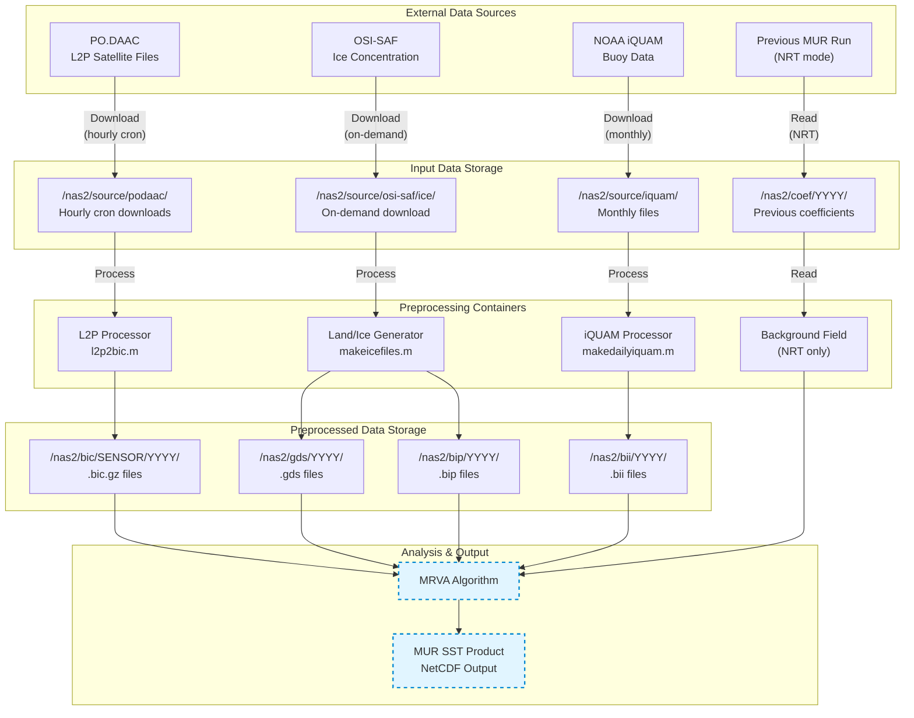
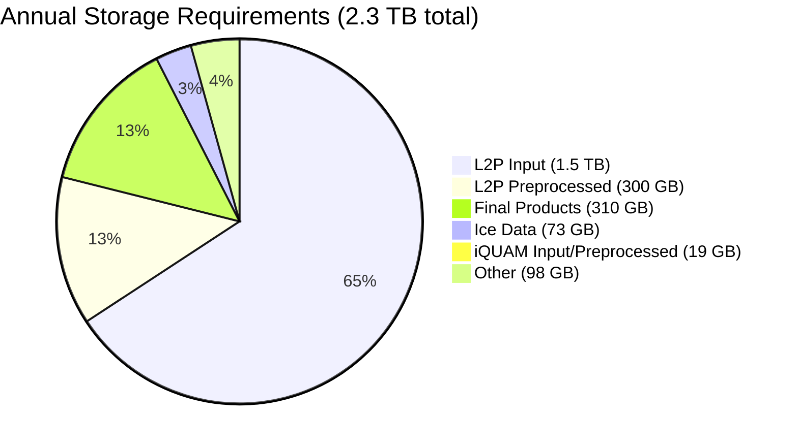

# MUR Data Lifecycle and Management

## Introduction

This document describes the complete data lifecycle for the MUR preprocessing pipeline, including data sources, download patterns, temporal windows, caching strategies, and storage requirements. Understanding the data flow is essential for operating and optimizing the MUR system.

## Table of Contents

1. [Overview](#overview)
2. [Data Sources](#data-sources)
3. [Temporal Windows](#temporal-windows)
4. [Download and Caching Strategy](#download-and-caching-strategy)
5. [Processing Modes](#processing-modes)
6. [Storage Requirements](#storage-requirements)
7. [Data Reuse and Access Patterns](#data-reuse-and-access-patterns)
8. [Quality Assurance](#quality-assurance)

## Overview

### Data Flow Architecture



### Key Principles

1. **Temporal Windows:** Data is collected over multi-day windows (±2-3 days)
2. **Caching:** Preprocessed files are retained indefinitely, reused across runs
3. **Stability Latency:** Respect data maturity periods before finalization
4. **Selective Reprocessing:** Only reprocess data younger than stability threshold
5. **Separation of Concerns:** Download operations separate from processing

## Data Sources

### 1. L2P Satellite Data (PO.DAAC)

**Provider:** NASA Physical Oceanography Distributed Active Archive Center (PO.DAAC)

**Format:** GHRSST Level 2P NetCDF files

**Collections:**

| Sensor | Collection ID | Provider | Update Frequency | Resolution |
|--------|--------------|----------|------------------|------------|
| **AMSR2R** | AMSR2-REMSS-L2P-v8.2 | Remote Sensing Systems | Orbital (~90 min) | ~25 km |
| **MODISA** | MODIS_A-JPL-L2P-v2019.0 | JPL | Orbital (~90 min) | ~1 km |
| **MODIST** | MODIS_T-JPL-L2P-v2019.0 | JPL | Orbital (~90 min) | ~1 km |
| **AVMTBG** | AVHRRMTB_G-NAVO-L2P-v2.0 | NAVO | Orbital (~100 min) | ~1-4 km |

**Download Method:**
- Tool: `podaac-data-subscriber` (Python)
- Schedule: Hourly cron jobs (automated, separate from processing)
- Authentication: NASA Earthdata Login
- Protocol: HTTPS

**Latency:**
- Standard products: 3-6 hours after observation
- Real-time products: 1-3 hours after observation
- Stability latency: 2-3 days (sensor-dependent)

**Typical Daily Volume per Sensor:**
- MODISA: ~200-300 granules/day, ~1-2 GB
- MODIST: ~200-300 granules/day, ~1-2 GB
- AMSR2R: ~30-50 granules/day, ~500 MB
- AVMTBG: ~40-80 granules/day, ~600 MB
- **Total:** ~4-5 GB/day (all sensors)

### 2. Sea Ice Concentration (OSI-SAF)

**Provider:** EUMETSAT Ocean and Sea Ice Satellite Application Facility

**Product:** OSI-401-b (Global sea ice concentration)

**Format:** NetCDF

**Resolution:** ~10 km (EASE2 grid)

**Update Frequency:** Daily

**Download Method:**
- Protocol: FTP or HTTP
- Scheduling: On-demand during processing
- Fallback: Up to 10 days backward if current day unavailable

**Latency:**
- Typically available within 6-12 hours of observation
- No stability latency (regenerated each run)

**Daily Volume:** ~200 MB/day

**Coverage:** Global, focus on polar regions

### 3. In-Situ Buoy Data (NOAA iQUAM)

**Provider:** NOAA In-situ Quality Monitor (iQUAM)

**Format:** NetCDF (monthly files)

**Platforms:**
- Ships (voluntary observing ships)
- Moored buoys (TAO, PIRATA, RAMA)
- Drifting buoys
- Coastal stations
- Argo floats (surface observations)
- ISAR tropical moorings
- High-resolution drifters
- Underwater gliders

**Download Method:**
- Protocol: HTTPS
- Schedule: Monthly file download as needed
- Caching: Strong (monthly .mat files in /tmp/makebic/)

**Update Frequency:** Monthly files updated daily with new observations

**File Size:** ~50-200 MB per month

**Quality Levels:**
- Level 5: Highest quality (passed all checks)
- MUR uses: quality_level >= 5 only

### 4. Background Field (NRT Mode Only)

**Source:** Previous day's MUR analysis

**Product:** Coefficient file at scale L=6

**File:** `mrva.c06` from previous day

**Purpose:** Initialize NRT processing at medium resolution

**Size:** ~50-100 MB

**Location:** `/nas2/coef/YYYY/`

## Temporal Windows

### Overview

Different components use different temporal windows based on:
- Sensor characteristics (temporal decorrelation)
- Data availability patterns
- Computational efficiency

### L2P Satellite Data

**Temporal Window:**
```
analysis_day ± dayrange

Where:
  dayrange = 2 (typical)
  Total window = 5 days
```

**Example:** Processing 2025-042 (February 11)
```
Days collected: 040, 041, 042, 043, 044
              (Feb 9-13)
```

**Stability Latency:**
```
Sensor        Stability (days)   Meaning
---------------------------------------------------------
MODISA        2                  Reprocess if age < 2 days
MODIST        3                  Reprocess if age < 3 days
AMSR2R        2                  Reprocess if age < 2 days
AVMTBG        2                  Reprocess if age < 2 days
```

**Rewrite Logic (NRT):**
```python
file_age = analysis_day - data_day
if file_age < stability_latency:
    rewrite = True   # Data still maturing
else:
    rewrite = False  # Use cached .bic file
```

**Processing Timeline:**

| Day | MODISA Stability=2 | Action |
|-----|-------------------|---------|
| 042 (today) | Age 0 | Process (fresh) |
| 041 (yesterday) | Age 1 | Reprocess (age < 2) |
| 040 (2 days ago) | Age 2 | Use cache (age >= 2) |
| 039 (3 days ago) | Age 3 | Use cache (stable) |
| 038 (4 days ago) | Age 4 | Use cache (stable) |

### iQUAM Buoy Data

**Temporal Window:**
```
analysis_day ± buoydayrange

Where:
  buoydayrange = 3 (typical)
  Total window = 7 days
```

**Example:** Processing 2025-042
```
Days collected: 039, 040, 041, 042, 043, 044, 045
              (Feb 8-14)
```

**Stability Latency:**
```
buoystablat = 2 days
```

**NRT Mode Behavior:**
- **Never reprocess** buoy files in NRT mode
- Reason: Monthly files are large (~100 MB); processing is expensive
- Strategy: First day processes, subsequent days use cache

**REA Mode Behavior:**
- Respect stability latency (reprocess if age < 2 days)
- More expensive but ensures complete reanalysis

### Ice Concentration Data

**Temporal Window:**
```
Single day: analysis_day
```

**No caching:** Regenerated every run

**Fallback Logic:**
```
Try: analysis_day
If unavailable, try: analysis_day - 1
If unavailable, try: analysis_day - 2
...
Maximum fallback: 10 days
```

**Rationale:** Ice extent changes rapidly; always use freshest available

## Download and Caching Strategy

### L2P Workflow

#### Stage 1: Automated Download (Separate from Processing)

**Cron Jobs (Hourly):**
```bash
# Run every hour
0 * * * * podaac-data-subscriber \
    -c AMSR2-REMSS-L2P-v8.2 \
    -d /nas2/source/podaac/AMSR2R/ \
    --start-date <TODAY> \
    --end-date <TODAY>
```

**Download Directory Structure:**
```
/nas2/source/podaac/
├── AMSR2R/
│   └── YYYY/
│       └── DOY/
│           ├── granule_001.nc
│           ├── granule_002.nc
│           └── ...
├── MODISA/
│   └── YYYY/DOY/...
├── MODIST/
│   └── YYYY/DOY/...
└── AVMTBG/
    └── YYYY/DOY/...
```

**Advantages:**
- Continuous data accumulation
- Processing independent of download failures
- Multiple granules available before processing

#### Stage 2: Preprocessing (On-Demand)

**Container Execution:**
```bash
docker run --rm \
  -v /nas2/source/podaac/MODISA:/input:ro \
  -v /nas2/bic/MODISA:/output \
  ghcr.io/podaac/mur-l2p:latest \
  2025 042 MODISA G10 nrt 2
```

**Output:**
```
/nas2/bic/MODISA/2025/
├── G10_MODISA_2025_040.bic.gz
├── G10_MODISA_2025_041.bic.gz
├── G10_MODISA_2025_042.bic.gz
├── G10_MODISA_2025_043.bic.gz
├── G10_MODISA_2025_044.bic.gz
└── L2Plist_G10_MODISA_2025_*.txt  (source tracking)
```

**Caching Behavior:**
```python
for day in [040, 041, 042, 043, 044]:
    output_file = f"/nas2/bic/MODISA/2025/G10_MODISA_2025_{day:03d}.bic.gz"

    if os.path.exists(output_file):
        age = analysis_day - day
        if age >= stability_latency:
            # Stable data, use cache
            print(f"Using cached {output_file}")
            continue
        else:
            # Still maturing, reprocess
            print(f"Reprocessing {output_file} (age={age} < {stability_latency})")

    # Process all granules for this day
    process_l2p_granules(day, sensor)
```

### iQUAM Workflow

#### Stage 1: Monthly File Download

**On first access of each month:**
```bash
wget https://www.star.nesdis.noaa.gov/pub/socd/mecb/iquam/v3/data/YYYY/YYYYMM.nc
```

**Storage:**
```
/nas2/source/iquam/
├── 2025/
│   ├── 202501.nc  (~100 MB)
│   ├── 202502.nc
│   └── ...
└── 2024/
    └── ...
```

#### Stage 2: MATLAB Caching

**makedailyiquam.m internal cache:**
```matlab
% Check for cached .mat file
matfile = sprintf('/tmp/makebic/iquam_%04d%02d.mat', year, month);
if exist(matfile, 'file')
    % Load cached monthly data
    load(matfile, 'iquam_data');
else
    % Download and parse NetCDF
    ncfile = download_iquam_month(year, month);
    iquam_data = parse_iquam_netcdf(ncfile);
    % Cache for future use
    save(matfile, 'iquam_data');
end

% Extract observations for requested day ± 3 days
subset = filter_by_date(iquam_data, analysis_day, dayrange=3);
```

#### Stage 3: Daily .bii Files

**Output:**
```
/nas2/bii/2025/
├── G10_IQUAM0_2025_042.bii
├── G10_IQUAM0_2025_043.bii
└── ...
```

**NRT Mode:** Never regenerate .bii files (expensive monthly file parsing)

**REA Mode:** Respect stability latency, regenerate if needed

### Ice Concentration Workflow

**No caching - always regenerate:**

```bash
# Download ice concentration for analysis day
docker run --rm \
  -v /nas2/source/osi-saf:/input \
  -v /nas2/gds:/output \
  ghcr.io/podaac/mur-landice:latest \
  2025 042 G10 p01

# If failed, try day - 1, day - 2, ... (up to 10 days back)
```

**Output:**
```
/nas2/gds/2025/
├── G10_2025_042.gds  (land/ice mask)
└── ...

/nas2/bip/2025/
├── G10_2025_042.bip  (ice SST points)
└── ...
```

**Rationale for no caching:**
- Ice extent changes daily
- File sizes small (~100 MB)
- Processing fast (~2-5 minutes)

## Processing Modes

### NRT (Near Real-Time) Mode

**Objectives:**
- Minimize processing time
- Maximize cache utilization
- Process current day as soon as data available

**Characteristics:**

| Component | Cache Behavior | Rewrite Logic |
|-----------|---------------|---------------|
| **L2P** | High cache hit | Only rewrite age < stability |
| **iQUAM** | 100% cache (NRT) | Never rewrite |
| **Ice** | Never cache | Always regenerate |
| **Background** | Use previous day | L=6 coefficients |

**Timeline:**



```mermaid
gantt
    title NRT Processing Timeline (Day 042)
    dateFormat HH:mm
    axisFormat %H:%M

    section Downloads
    Hourly L2P cron jobs     :active, download, 00:00, 06:00

    section Preprocessing
    Ice mask generation      :ice, 09:00, 5m
    L2P day 042 (fresh)      :l2p042, after ice, 60m
    L2P day 041 (reprocess)  :l2p041, after ice, 60m
    iQUAM (cached)           :iquam, after ice, 1m

    section Analysis
    MRVA processing          :crit, mrva, after l2p042, 1h
    NetCDF generation        :netcdf, after mrva, 30m

    section Milestones
    L2P data ready           :milestone, m1, 06:00, 0m
    Processing starts        :milestone, m2, 09:00, 0m
    Product available        :milestone, m3, 12:00, 0m
```

**Processing Steps:**
- **00:00-06:00** - Hourly cron downloads L2P granules throughout day
- **06:00** - Most L2P data for day 042 available
- **09:00** - Run MUR processing for day 042
  - Ice: Generate fresh (5 min)
  - L2P day 042: Process fresh (~60 min all sensors)
  - L2P day 041: Reprocess (age=1 < stability=2)
  - L2P day 040: Use cache (age=2 >= stability=2)
  - iQUAM: Use cached .bii files (<1 min)
  - Background: Load day 041 coefficients (L=6)
- **10:30** - MRVA: Run analysis (~30-90 min NRT, longer for REA)
- **12:00** - MUR product available (~3 hours total latency)

**Cache Hit Rate Estimates (Day 042):**
```
L2P (stability=2):
  Day 042: 0% cache (fresh)
  Day 041: 0% cache (reprocessed, age < 2)
  Day 040: 100% cache (stable, age >= 2)
  Day 039: 100% cache (stable)
  Overall: ~40% cache hits

iQUAM:
  All days: 100% cache (NRT skip rewrite)

Ice:
  0% cache (always fresh)
```

### REA (Reanalysis) Mode

**Objectives:**
- Maximum accuracy
- Complete reprocessing
- Historical date processing

**Characteristics:**

| Component | Cache Behavior | Rewrite Logic |
|-----------|---------------|---------------|
| **L2P** | Respect stability | Rewrite if age < stability |
| **iQUAM** | Respect stability | Rewrite if age < 2 days |
| **Ice** | Never cache | Always regenerate |
| **Background** | No background | Start from L=2 |

**Timeline:**
```
Day 042 (historical) processing:

- All data fully mature (processing weeks/months later)
- No stability latency issues
- All cache hits (unless explicitly forcing regeneration)
- Start from L=2 (coarse scale), no background field
- More iterations, higher accuracy
- Processing time: 2-4x longer than NRT
```

**Cache Hit Rate (Historical Date):**
```
If first time processing:
  L2P: 0% cache (all fresh)
  iQUAM: 0% cache (all fresh)
  Ice: 0% cache (always fresh)

If reprocessing:
  L2P: 100% cache (all stable)
  iQUAM: 100% cache (all stable)
  Ice: 0% cache (always fresh)
```

## NRT/REA Coefficient File Lifecycle

### Overview

In operational production, each date is processed **twice**:
1. **NRT (Near Real-Time)**: First pass, 1 day after observation
2. **REA (Reanalysis)**: Second pass, 4 days after observation

This dual-processing approach balances timeliness (NRT) with accuracy (REA), using a sophisticated coefficient file chain for continuity.

### Coefficient File Scales

MRVA produces coefficient files at multiple B-spline scales (L values):

| Scale (L) | Description | Grid Spacing | Purpose |
|-----------|-------------|--------------|---------|
| L=2 | Coarsest | ~100 km | REA starting point |
| L=6 | Medium | ~6 km | NRT starting point (background) |
| L=7-10 | Fine | ~3-0.4 km | Progressive refinement |
| L=11 | Finest | ~0.2 km | Final high-resolution |

### File Naming Convention

```
YYYYDDDHH_MRVA4_Global.cXX[.gz]

Where:
  YYYY  = Year
  DDD   = Day of year (001-366)
  HH    = Analysis hour (typically 09)
  XX    = Scale level (02-11)
```

**Examples:**
```
2025042009_MRVA4_Global.c06    # Scale 6, day 042, hour 09
2025042009_MRVA4_Global.c11    # Scale 11 (finest), day 042
```

### NRT Mode (realtime=1)

**Latency:** 1 day after observation date

**Starting Scale:** L0=7 (skips coarse scales)

**Coefficient Files Produced:** `.c07`, `.c08`, `.c09`, `.c10`, `.c11`

**Background Field:** Looks for previous day's `.c06` file

**Directory:** `coef/YYYY/nrt/` (with "nrt" suffix)

```
coef/
└── 2025/
    └── nrt/
        ├── 2025041009_MRVA4_Global.c07
        ├── 2025041009_MRVA4_Global.c08
        ├── ...
        ├── 2025042009_MRVA4_Global.c07
        ├── 2025042009_MRVA4_Global.c08
        └── ...
```

### REA Mode (realtime=0)

**Latency:** 4 days after observation date (allows complete data accumulation)

**Starting Scale:** L0=2 (full multi-scale analysis)

**Coefficient Files Produced:** `.c02`, `.c03`, `.c04`, `.c05`, `.c06`, `.c07`, `.c08`, `.c09`, `.c10`, `.c11`

**Background Field:** None (starts fresh from coarse scale)

**Directory:** `coef/YYYY/` (no suffix)

```
coef/
└── 2025/
    ├── 2025038009_MRVA4_Global.c02  # Includes .c06
    ├── 2025038009_MRVA4_Global.c03
    ├── 2025038009_MRVA4_Global.c04
    ├── 2025038009_MRVA4_Global.c05
    ├── 2025038009_MRVA4_Global.c06  # ← Created by REA
    ├── 2025038009_MRVA4_Global.c07
    └── ...
```

### The .c06 Background Lookup

When NRT runs, it attempts to use the previous day's `.c06` coefficient as a starting background field. This provides a "warm start" that helps maintain spatial coherence.

**Lookup Logic (trimbip3a.m):**

```matlab
% Try to find previous day's .c06 file for background
MURcsp = sprintf('%s/%04d/YYYYDDDHH_MRVA4_Global.c06', coefdir, prev_year);

if exist(MURcsp, 'file')
    % Use MUR reference - fast path
    refcspfile = 'MUR.csp';
    eval(sprintf('!ln -sf %s %s', MURcsp, refcspfile));
else
    % Fallback: Use L4 AVHRR_OI reference or build from scratch
    % Look for L4 GHRSST file...
end
```

### The Key Insight: .c06 Is Only Created by REA

**Critical Understanding:**

| Mode | Creates .c06? | Uses .c06? |
|------|---------------|------------|
| **NRT** | ❌ No (starts at L=7) | ✅ Yes (from previous day) |
| **REA** | ✅ Yes (runs L=2-11) | ❌ No (starts from scratch) |

**Timeline Implication:**

Since REA runs with a 4-day latency, the `.c06` file for day N is created 4 days after day N. This means:

- Day N+1 (NRT): Looks for day N's `.c06` → **Not available yet** (REA hasn't run)
- Day N+2 (NRT): Looks for day N+1's `.c06` → **Not available yet**
- Day N+3 (NRT): Looks for day N+2's `.c06` → **Not available yet**
- Day N+4 (NRT): Looks for day N+3's `.c06` → **Not available yet**
- Day N+5 (NRT): Looks for day N+4's `.c06` → **Available!** (REA for day N+4 just ran)

### Steady-State Production Behavior

In operational production with continuous NRT+REA processing:

```
Timeline for Day 042:
─────────────────────────────────────────────────────────────────
Day 042:  [Observations collected]
Day 043:  NRT for 042 runs → outputs .c07-.c11, looks for 041's .c06 (missing)
Day 046:  REA for 042 runs → outputs .c02-.c11 including .c06 ← FINAL PRODUCT
─────────────────────────────────────────────────────────────────

Coefficient availability when NRT runs for day 046:
  └── Looks for day 045's .c06 → Day 045 REA ran on day 049 → NOT YET AVAILABLE

Therefore: Most NRT runs fall back to building reference from scratch
```

**This is expected behavior.** The `.c06` background is a performance optimization, not a requirement. When unavailable, the system:

1. Falls back to L4 AVHRR_OI data if available
2. Or builds the reference field from the current data

Production logs confirm this with "not opened" messages for `.c06` files:

```
Checking coef/2025/2025045009_MRVA4_Global.c06: not opened  ← Normal
```

### When .c06 Background IS Available

The `.c06` background is available only when NRT runs immediately after a REA run for a nearby date. This happens in specific scenarios:

1. **First NRT after catchup:** If REA processing catches up (e.g., after an outage), subsequent NRT runs benefit from recently-created `.c06` files.

2. **Reprocessing:** When reprocessing historical dates, REA runs first, making `.c06` available for any subsequent NRT testing.

### Practical Implications

**For Container Testing:**

If you only run NRT mode, you'll only see `.c07-.c11` files. This is correct. To generate `.c06` files, run in REA mode (`realtime=0`).

**For Pipeline Operations:**

- NRT products are interim/preliminary
- REA products are the final, authoritative versions
- Storage planning should account for both sets of coefficient files
- Downstream consumers should prefer REA products when available

### Directory Structure Summary

```
coef/
└── YYYY/
    ├── YYYYDDDHH_MRVA4_Global.c02   # REA only
    ├── YYYYDDDHH_MRVA4_Global.c03   # REA only
    ├── YYYYDDDHH_MRVA4_Global.c04   # REA only
    ├── YYYYDDDHH_MRVA4_Global.c05   # REA only
    ├── YYYYDDDHH_MRVA4_Global.c06   # REA only ← Key for NRT background
    ├── YYYYDDDHH_MRVA4_Global.c07   # Both modes
    ├── ...
    ├── YYYYDDDHH_MRVA4_Global.c11   # Both modes (final resolution)
    │
    └── nrt/                         # NRT-specific outputs
        ├── YYYYDDDHH_MRVA4_Global.c07
        ├── ...
        └── YYYYDDDHH_MRVA4_Global.c11
```

### Output Product Generation

Both NRT and REA modes use the finest coefficient file (`.c11`) to generate the final MUR SST NetCDF product. The difference is:

| Product | Source | Quality | Use Case |
|---------|--------|---------|----------|
| NRT MUR | `.c11` from NRT | Preliminary | Real-time applications |
| REA MUR | `.c11` from REA | Final | Archives, reanalysis |

The REA product replaces/supersedes the NRT product for the same date.

## Storage Requirements

### Input Data

**Daily Accumulation:**

| Source | Daily Volume | Retention | Annual |
|--------|--------------|-----------|--------|
| L2P (all sensors) | ~4-5 GB | Indefinite | ~1.5 TB |
| iQUAM (monthly) | ~100 MB/month | Indefinite | ~1.2 GB |
| Ice concentration | ~200 MB | Indefinite | ~73 GB |
| **Total Input** | **~4.7 GB/day** | | **~1.6 TB/year** |

### Preprocessed Data

**Daily Output:**

| Product | Daily Volume | Retention | Annual |
|---------|--------------|-----------|--------|
| .bic files (all sensors) | ~500-800 MB | Indefinite | ~300 GB |
| .bii files (buoys) | ~50 MB | Indefinite | ~18 GB |
| .gds/.bip (ice) | ~100 MB | Indefinite | ~37 GB |
| **Total Preprocessed** | **~650-950 MB/day** | | **~350 GB/year** |

### Final Products

**Daily Output (estimated):**

| Product | Daily Volume | Retention | Annual |
|---------|--------------|-----------|--------|
| MUR NetCDF | ~500 MB | Indefinite | ~183 GB |
| Coefficient files | ~350 MB | Configurable | ~128 GB |
| **Total Output** | **~850 MB/day** | | **~310 GB/year** |

### Total Storage (One Year)



**Breakdown:**
- Input data:        1.6 TB (70%)
- Preprocessed:      350 GB (15%)
- Final products:    310 GB (13%)
- **Total:**         ~2.3 TB/year

**Growth Rate:** ~6.3 GB/day (all components)

**Recommendations:**
- Fast storage (SSD/NVMe) for active processing: 500 GB - 1 TB
- Bulk storage for archives: 10+ TB for multi-year holdings
- Backup strategy: Critical products only (reduce to ~500 GB/year)

## Data Reuse and Access Patterns

### Multi-Day Processing Windows

**Key Insight:** Each day's data is used in multiple processing runs

**L2P Example (dayrange=2):**

| Data Day | Used When Processing | Total Uses |
|----------|---------------------|------------|
| 040 | Days 038, 039, 040, 041, 042 | 5 times |
| 041 | Days 039, 040, 041, 042, 043 | 5 times |
| 042 | Days 040, 041, 042, 043, 044 | 5 times |

**iQUAM Example (buoydayrange=3):**

| Data Day | Used When Processing | Total Uses |
|----------|---------------------|------------|
| 039 | Days 036, 037, 038, 039, 040, 041, 042 | 7 times |

**Implication:**
- First access may download and process (expensive)
- Subsequent accesses use cached files (fast)
- High cache hit rates in operational NRT processing
- Storage investment pays off through reuse

### Access Frequency

**Typical NRT Day (Day 042):**

```
Ice Data:
  Download day 042: 1 time
  Process: 1 time
  Reuse: 0 times (regenerated daily)

L2P Data (per sensor):
  Download days 040-044: 5 days
  Process day 042: 1 time (fresh)
  Reprocess day 041: 1 time (age < stability)
  Read cached days 040, 039, 038: 3 times

iQUAM Data:
  Download monthly file: 1 time per month
  Read cached .bii files: 7 days (all from cache in NRT)
```

### Cache Efficiency Metrics

**NRT Mode (Operational):**
```
L2P Cache Hit Rate: ~40-60%
  - Fresh data: ~20% (current day + within stability window)
  - Cached data: ~80% (outside stability window)

iQUAM Cache Hit Rate: 100% (NRT skip rewrite)

Ice Cache Hit Rate: 0% (no caching)

Overall Data Throughput:
  - Fresh processing: ~2-3 GB/day
  - Cached reads: ~2-3 GB/day
  - Total: ~5 GB/day (vs ~50 GB if no caching)
```

**REA Mode (Historical):**
```
First Run:
  Cache Hit Rate: 0% (all fresh)
  Throughput: ~5 GB/day

Subsequent Runs (same date):
  Cache Hit Rate: 95% (only ice regenerated)
  Throughput: ~500 MB/day
```

## Quality Assurance

### Input Data Validation

**L2P Granules:**
- File count per day (expect 200-300 for MODIS)
- Temporal coverage (should span 24 hours)
- Spatial coverage (global vs regional gaps)
- Quality flags (confidence levels)

**iQUAM Observations:**
- Monthly file completeness
- Quality level distribution (target: >=5)
- Platform type coverage
- Temporal distribution

**Ice Concentration:**
- File availability (fallback if needed)
- Spatial extent (polar regions)
- Concentration range (0-100%)

### Output Validation

**L2P .bic Files:**
- File size sanity check (50-500 MB range)
- Observation count statistics
- SST range check (-2°C to 45°C)
- L2Plist companion file generation

**iQUAM .bii Files:**
- Observation count per day
- Geographic distribution
- Platform type representation

**Ice .gds/.bip Files:**
- Mask value validation (1, 2, 3, 5, 7, 9, 11, 13, 15)
- Ice extent reasonableness
- Bitwise flag consistency

### Download Monitoring

**Automated Checks:**
- Hourly cron job success/failure logs
- Daily download reports (granule counts)
- Missing data identification
- Storage capacity monitoring

**Alerts:**
- Download failures (>2 hours of consecutive failures)
- Unexpected file counts (e.g., <50 MODIS granules in 24 hours)
- Storage threshold exceeded (>90% capacity)

### Cache Health

**Metrics:**
- Cache hit rates per component
- Disk usage trends
- File age distribution
- Orphaned file detection

**Maintenance:**
- Periodic cache validation (file integrity)
- Cleanup of incomplete downloads
- Archival of old data to slower storage

### L2P Download Purge

The pipeline includes a purge stage that removes old L2P download directories past a rolling window threshold, mirroring the production `mur_cron/purge/purge.py` behavior. This prevents unbounded growth of the L2P download area.

**Configuration:**
- `purge.threshold_days`: Number of days after which DOY directories are deleted (default: 30)
- `purge.logs_dir`: Directory for dated purge log reports

**Behavior:**
- Scans each active sensor's `{input_dir}/{sensor}/{year}/` directory
- Removes DOY subdirectories where `DOY < current_DOY - threshold_days`
- Operates only within the current year
- Writes summary and detailed removal reports to a dated log file

**Usage:**
```bash
# Must be explicitly requested -- not part of the default pipeline run
uv run mur-pipeline --config config.json --execute purge
```

**Note:** The purge stage only affects raw L2P download directories (NetCDF granules from PO.DAAC). It does not touch preprocessed BIC files, which are retained indefinitely for reuse.

---

## Summary

The MUR data lifecycle is designed for:

1. **Efficiency:** Heavy caching minimizes redundant processing
2. **Timeliness:** NRT mode optimized for low-latency delivery
3. **Accuracy:** REA mode respects data stability for reanalysis
4. **Robustness:** Fallback logic and retry mechanisms
5. **Scalability:** Modular design supports adding new sensors

Key takeaways:

- **Separation of concerns:** Downloads happen independently of processing
- **Intelligent caching:** Stability latency determines when to reprocess
- **Multi-day windows:** Data reused across multiple processing runs
- **Mode-specific optimization:** NRT favors speed, REA favors accuracy
- **Storage investment:** ~2.3 TB/year enables operational efficiency

---

## References

For detailed implementation:
- `run_mur_pipeline.py` - Orchestration logic
- `l2p/README.md` - L2P processing details
- `iquam/README.md` - iQUAM processing details
- `landice/README.md` - Ice processing details
- `mur-internal/PROCESSING_FLOW_REPORT.md` - Comprehensive flow analysis

---

*Last Updated: 2025-01-18*
*Documentation Version: 1.0*
