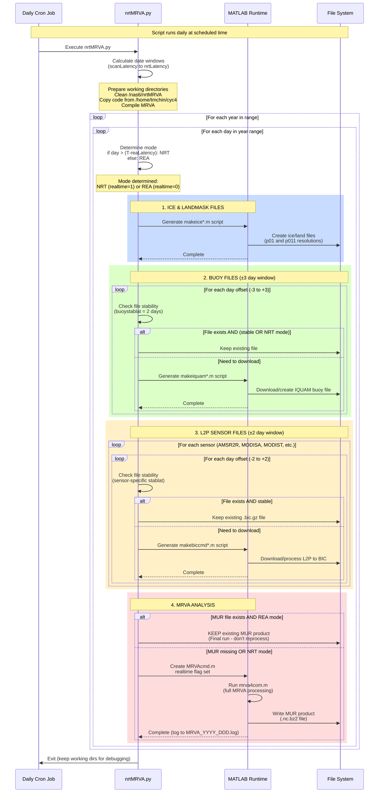

# MUR Daily Execution Sequence

## Overview

The `nrtMRVA.py` script runs daily as a cron job and processes multiple days in a single execution. It intelligently determines whether each day should be processed in **NRT (Near Real-Time)** or **REA (Reanalysis)** mode based on data latency windows.

## Mode Definitions

### NRT Mode (Near Real-Time / "Interim")
- **When**: For days within the most recent `nrtLatency` period (default: 1 day from today)
- **Purpose**: Quick preliminary analysis with the most current available data
- **Behavior**:
  - Processes recent days that may have incomplete or unstable source data
  - Does NOT overwrite existing MUR products
  - Does NOT re-download stable source files
  - Logged as "Interim run"
  - `realtime = 1` flag passed to MATLAB

### REA Mode (Reanalysis / "Final")
- **When**: For days older than `reaLatency` (default: 4 days from today)
- **Purpose**: Final, authoritative analysis with stable, complete data
- **Behavior**:
  - Processes days when all source data should be stable and complete
  - WILL overwrite existing MUR products if they exist
  - MAY re-download source files if within their `stablat` window
  - Logged as "Final run"
  - `realtime = 0` flag passed to MATLAB

## Time Windows

```
Today (T)
│
├─ T-1 day  ──→ nrtLatency (end of NRT window)
│
├─ T-4 days ──→ reaLatency (end of REA window / start of NRT window)
│
└─ T-9 days ──→ scanLatency (start of processing window)
```

**Processing range**: Days from (T - scanLatency) to (T - nrtLatency)

**Mode determination**:
- Days from (T-9) to (T-4): **REA mode** (Final run)
- Days from (T-3) to (T-1): **NRT mode** (Interim run)

## Daily Execution Flow



## Key Behavioral Differences

| Aspect | REA Mode (realtime=0) | NRT Mode (realtime=1) |
|--------|----------------------|---------------------|
| **Age of data** | Older than 4 days | 1-3 days old |
| **Data stability** | Complete and stable | May be incomplete |
| **MUR overwrite** | YES - skip if final exists | YES - always process |
| **Source file rewrite** | YES - if within stablat | NO - never rewrite |
| **Purpose** | Final authoritative product | Preliminary quick analysis |
| **Log label** | "Final run" | "Interim run" |

## Source Data Stability Windows

Each data source has a `stablat` (stability latency) parameter that defines when data becomes stable:

- **Buoy data (IQUAM)**: 2 days
- **AMSR2R**: 2 days
- **MODISA**: 2 days
- **MODIST**: 3 days
- **AVMTAG/AVMTBG**: 2 days

### Rewrite Logic

For **REA mode**:
```
if (today - data_day) < stablat:
    rewrite = 1  # Data still unstable, re-download
else:
    rewrite = 0  # Data stable, keep existing file
```

For **NRT mode**:
```
rewrite = 0  # Never re-download in NRT mode
```

## Example Daily Execution

**Today**: 2025-12-04 (day 338, year 2025)

### Calculated windows:
- `day0` (scanLatency): 2025-11-25 (day 329) - start of REA
- `day1` (reaLatency): 2025-11-30 (day 334) - end of REA / start of NRT
- `day2` (nrtLatency): 2025-12-03 (day 337) - end of NRT

### Processing loop:

| Date | Mode | Reason | MUR Behavior |
|------|------|--------|--------------|
| 2025-11-25 (day 329) | **REA** | day ≤ 334 | Overwrite if exists |
| 2025-11-26 (day 330) | **REA** | day ≤ 334 | Overwrite if exists |
| 2025-11-27 (day 331) | **REA** | day ≤ 334 | Overwrite if exists |
| 2025-11-28 (day 332) | **REA** | day ≤ 334 | Overwrite if exists |
| 2025-11-29 (day 333) | **REA** | day ≤ 334 | Overwrite if exists |
| 2025-11-30 (day 334) | **REA** | day ≤ 334 | Overwrite if exists |
| 2025-12-01 (day 335) | **NRT** | day > 334 | Always process |
| 2025-12-02 (day 336) | **NRT** | day > 334 | Always process |
| 2025-12-03 (day 337) | **NRT** | day > 334 | Always process |

Each day processes:
- Ice/land masks for that specific day
- Buoy data for ±3 day window (7 days total)
- L2P sensor data for ±2 day window (5 days total)
- MRVA analysis for that specific day

## Critical Implementation Details

### 1. MUR Product Overwrite Logic (lines 385-405)

```python
if os.path.exists(MURfile) and (realtime==0):
    # REA mode: keep existing final product
    f.write('KEEPING OLD %s\n'%MURfile)
else:
    # NRT mode OR missing file: run MRVA
    # Generate MRVAcmd.m and execute
```

**Important**: In REA mode, if the MUR product already exists, it is **kept** (not overwritten). This prevents reprocessing of finalized data.

### 2. Source File Rewrite Logic (lines 256-266 for buoy, 325-332 for L2P)

```python
# Determine stability of source file(s):
if datetime.date.today().toordinal() - ordday(d,y) < stablat:
    rewrite = 1  # Still unstable
else:
    rewrite = 0  # Now stable

if realtime == 1:
    rewrite = 0  # Override: never rewrite in NRT mode
```

### 3. File Existence Check (lines 279-301 for buoy, 340-369 for L2P)

```python
if os.path.exists(bicfile) and (rewrite==0):
    f.write('keeping old %s\n'%bicfile)
else:
    # Download/generate the file
```

## Processing Window Rationale

The 9-day scan window serves multiple purposes:

1. **Data arrives gradually**: Some sensors have 2-3 day latency
2. **Stability verification**: Files within `stablat` may be updated
3. **Gap filling**: Missing data from previous runs can be filled
4. **Final consolidation**: REA mode ensures complete, stable products

## Logging

All actions logged to `/home/tmchin/logs/nrtMRVA.log`:
- Daily execution header with date ranges
- Mode for each day ("Interim run" vs "Final run")
- File operations (kept vs created)
- MATLAB command executions

Individual MRVA runs also logged to: `/home/tmchin/logs/MRVA_YYYY_DDD.log`

## Summary

**The key insight**: This script creates a "rolling window" processing system where:
- Recent days (1-3 days old) get **quick preliminary NRT analysis**
- Older days (4-9 days old) get **final authoritative REA analysis**
- Each daily execution processes multiple historical days to handle late-arriving data
- The system never re-downloads stable data unnecessarily
- REA mode won't reprocess existing final products (conservative approach)

This design balances **timeliness** (NRT for recent data) with **quality** (REA for finalized data).
