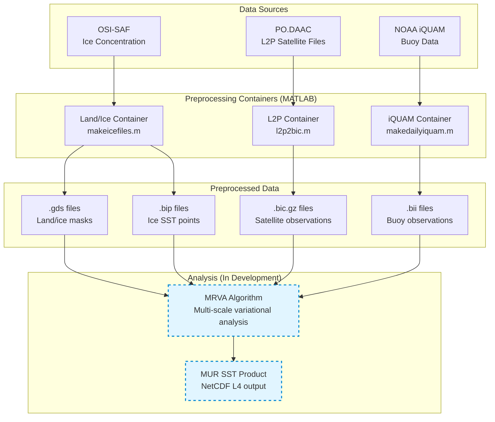

# MUR System Overview

## Introduction

The Multi-scale Ultra-high Resolution (MUR) Sea Surface Temperature (SST) analysis is a global, gap-free, gridded SST product at ~1 km resolution. This document provides a high-level overview of the MUR preprocessing pipeline and system architecture.

## System Architecture

The MUR system consists of several preprocessing components that prepare input data for the Multi-Resolution Variational Analysis (MRVA) algorithm:



## Core Components

### 1. Land/Ice Mask Generation ([landice/](../landice/))

**Purpose:** Create land and sea ice masks for the analysis domain

**Input:**
- OSI-SAF sea ice concentration data
- Static land masks

**Output:**
- `.gds` files: Land/ice masks with bitwise encoding
- `.bip` files: Ice SST point data

**Technology:** Containerized MATLAB (R2024b Runtime)

**Processing:** Generates masks for both p01 (0.01°) and p011 (0.011°) resolutions

See [LANDICE_ENCODING.md](LANDICE_ENCODING.md) for detailed mask encoding information.

### 2. L2P Satellite Data Processing ([l2p/](../l2p/))

**Purpose:** Convert GHRSST L2P satellite data into MRVA-compatible format

**Supported Sensors:**
- **AMSR2R** - Microwave radiometer (all-weather, ~25km resolution)
- **MODISA** - MODIS Aqua infrared (~1km resolution)
- **MODIST** - MODIS Terra infrared (~1km resolution)
- **AVMTBG** - AVHRR MetOp-B infrared (~1-4km resolution)

**Input:** GHRSST L2P NetCDF files from PO.DAAC

**Output:** `.bic.gz` files (Binary Input with Confidence)

**Technology:** Containerized MATLAB with sensor-specific configurations

**Key Features:**
- Quality filtering by confidence thresholds
- **Nighttime-only observations** (avoids diurnal warming effects)
- Sensor-specific scale parameters (La/Lb)
- Stability latency handling (2-3 day data maturity)
- Bias correction and error estimation

**Note:** MUR uses nighttime observations from infrared sensors to measure **foundation temperature** and avoid solar-induced diurnal warming. See [FUTURE_ENHANCEMENTS.md](FUTURE_ENHANCEMENTS.md) for discussion of daytime data processing considerations.

See [SENSOR_ADAPTATION.md](SENSOR_ADAPTATION.md) for adding new sensors.

### 3. iQUAM Buoy Data Processing ([iquam/](../iquam/))

**Purpose:** Process in-situ buoy/ship observations for MRVA

**Input:** NOAA iQUAM monthly NetCDF files

**Output:** `.bii` files (Binary IQUAM Instrument format)

**Technology:** Containerized MATLAB orchestrator

**Key Features:**
- Quality control filtering (quality_level >= 5)
- Platform type handling (ships, buoys, drifters, etc.)
- Monthly file caching for performance
- Temporal aggregation (±3 days)

### 4. Pipeline Orchestrator ([run_mur_pipeline.py](../run_mur_pipeline.py))

**Purpose:** Coordinate all preprocessing steps for a given analysis date

**Functionality:**
- NRT/REA mode detection
- Temporal window calculation
- Component sequencing
- Container execution management
- L2P download purge (on-demand cleanup of old DOY directories)

**Status:** Currently handles preprocessing; MRVA integration pending

## Containerized MATLAB Approach

### Why Containers?

The MUR system uses Docker containers with MATLAB Runtime for several key benefits:

1. **No License Required:** MATLAB Runtime is free for compiled applications
2. **Production Parity:** Same interface as legacy `nrtMRVA.py` system
3. **Reproducibility:** Consistent execution environment
4. **Smaller Footprint:** ~2.5 GB runtime vs ~8 GB with full Python/MATLAB
5. **Platform Independence:** Runs on any Docker-compatible system

### Container Architecture Pattern

All preprocessing containers follow a common pattern:

**Multi-Stage Build:**
```dockerfile
# Stage 1: Builder (compile MATLAB code)
FROM mathworks/matlab:r2024b AS builder
RUN matlab -batch "mcc -m wrapper.m ..."

# Stage 2: Runtime (minimal execution environment)
FROM mathworks/matlab-runtime:r2024b
COPY --from=builder /build/wrapper /app/
```

**Execution:**
```bash
docker run --rm \
  --platform linux/amd64 \
  --shm-size=512M \
  -v /input:/input:ro \
  -v /output:/output \
  ghcr.io/nasa-jpl/mur-<component>:latest \
  <args...>
```

**Key Requirements:**
- `--shm-size=512M` for MATLAB Runtime shared memory
- Volume mounts for input/output data
- Positional string arguments (year, DOY, region, etc.)

## Processing Modes

### NRT (Near Real-Time) Mode

**Characteristics:**
- Processes current day as soon as data is available
- Uses previous day's MUR output as background field
- Optimizes for speed over completeness
- Skips reprocessing of stable historical data

**Timeline:** Analysis available ~6-12 hours after observation time

### REA (Reanalysis) Mode

**Characteristics:**
- Processes historical dates with complete data holdings
- Respects stability latency for all sensors
- Regenerates all intermediate files
- Optimizes for accuracy and completeness

**Timeline:** Can process any historical date with available input data

See [DATA_LIFECYCLE.md](DATA_LIFECYCLE.md) for detailed mode differences.

## Data Flow Overview

### Typical Processing Timeline (NRT)

```
Day D-3 to D+2: L2P satellite data collection
Day D-3 to D+3: Buoy data aggregation
Day D:          Ice concentration data
Day D:          Land/Ice mask generation
Day D:          L2P preprocessing (5-day window)
Day D:          iQUAM preprocessing (7-day window)
Day D:          MRVA analysis [PENDING]
Day D:          NetCDF output generation [PENDING]
```

### Data Volumes

**Input per Day (typical):**
- L2P satellite: ~4 GB (compressed granules)
- iQUAM buoys: ~50 MB (monthly files, reused)
- Ice concentration: ~200 MB
- **Total:** ~4.7 GB/day

**Preprocessed Output per Day:**
- Land/Ice masks: ~100 MB
- L2P .bic files: ~500-800 MB (all sensors)
- iQUAM .bii files: ~50 MB
- **Total:** ~650-950 MB/day

**Final Products per Day:** [PENDING MRVA COMPLETION]
- MUR SST NetCDF: ~500 MB
- Coefficient files: ~350 MB
- **Total:** ~850 MB/day

## File Naming Conventions

### Regions

Analysis regions are identified by short codes:
- `G10` - Global 1km (10km in legacy notation)
- `S01` - Southern Ocean 1km
- Additional regions as configured

### Date Formats

- `YYYY` - 4-digit year (e.g., 2025)
- `DDD` - Day of year (001-366)
- `YYYYDDD` - Combined year and day (e.g., 2025042)

### File Extensions

- `.gds` - Grid Data Static (land/ice masks)
- `.bip` - Binary Ice Points (ice SST observations)
- `.bic.gz` - Binary Input with Confidence (L2P satellite, compressed)
- `.bii` - Binary IQUAM Instrument (buoy data)
- `.nc` - NetCDF (input and final output)

**Example:** `G10_MODISA_2025_042.bic.gz`
- Region: G10 (Global 1km)
- Sensor: MODISA (MODIS Aqua)
- Date: 2025, day 42 (February 11)

## Technology Stack

### Core Dependencies

- **Python 3.11+** - Pipeline orchestration
- **Docker** - Container runtime
- **MATLAB R2024b Runtime** - Compiled application execution
- **uv** - Python package and environment management

### Data Access Tools

- **podaac-data-subscriber** - PO.DAAC L2P data downloads
- **wget/curl** - OSI-SAF ice data retrieval
- **netCDF4** - NetCDF file manipulation

### Development Tools

- **MATLAB R2024b** - Code development and compilation
- **MATLAB Compiler** - Standalone executable generation

## File Locations

### Input Data (Example Production Paths)

```
/nas2/source/osi-saf/ice/YYYY/    - Ice concentration data
/nas2/source/podaac/SENSOR/YYYY/  - L2P granules (per sensor)
/nas2/source/iquam/YYYY/          - iQUAM monthly files
```

### Preprocessed Data

```
/nas2/gds/YYYY/                   - Land/ice masks
/nas2/bip/YYYY/                   - Ice SST points
/nas2/bic/SENSOR/YYYY/            - L2P processed (per sensor)
/nas2/bii/YYYY/                   - iQUAM processed
```

### Output Products [PENDING]

```
/nas2/output/YYYY/                - Final MUR NetCDF files
/nas2/coef/YYYY/                  - MRVA coefficient files
```

**Note:** Paths are configurable via environment variables and container volumes.

## Performance Characteristics

### Processing Time (Single Day, NRT Mode)

- Land/Ice: ~2-5 minutes
- L2P MODISA: ~10-20 minutes (200-300 granules)
- L2P MODIST: ~10-20 minutes (200-300 granules)
- L2P AMSR2R: ~5-10 minutes (30-50 granules)
- L2P AVMTBG: ~5-10 minutes (40-80 granules)
- iQUAM: ~5-15 minutes (cached monthly files)
- **Total Preprocessing:** ~40-80 minutes

**MRVA Analysis:** [Timing TBD upon implementation]

### Resource Requirements

- **Memory:** 8-16 GB RAM recommended
- **Disk I/O:** Fast storage recommended (SSD preferred)
- **Network:** Stable connection for PO.DAAC downloads
- **Docker:** `--shm-size=512M` minimum for containers

### Parallelization

Components can run in parallel:
- Each L2P sensor processes independently
- Land/Ice and iQUAM can run concurrently
- Pipeline orchestrator coordinates sequencing

## Quality Assurance

### Input Validation

- NetCDF file structure verification
- Temporal coverage checks
- Missing data detection
- Quality flag filtering

### Output Verification

- File size sanity checks
- Data range validation (SST: -2°C to 45°C)
- Observation count statistics
- Companion file generation (L2Plist files)

### Monitoring

- Processing logs per component
- Error reporting and stack traces
- Timing statistics
- Data availability tracking

## Migration Status

### Current State (Containerized Preprocessing)

- ✅ Land/Ice mask generation
- ✅ L2P satellite processing (4 sensors)
- ✅ iQUAM buoy processing
- ✅ Pipeline orchestrator
- ⏳ MRVA analysis (in development)
- ⏳ NetCDF output generation (in development)

### Legacy System

The original `nrtMRVA.py` system used:
- Python wrappers calling MATLAB via subprocess
- Direct MATLAB license dependency
- Monolithic processing script

### Benefits of Containerized Approach

- **Licensing:** No MATLAB license required in production
- **Modularity:** Independent container updates
- **Testing:** Isolated component testing
- **Deployment:** Simplified production deployment
- **Consistency:** Identical behavior across environments

## Getting Started

### Quick Start

1. **Install Dependencies:**
   ```bash
   cd mur/
   uv sync
   ```

2. **Build Containers:**
   ```bash
   cd landice/ && docker build -t mur-landice .
   cd ../l2p/ && docker build -t mur-l2p .
   cd ../iquam/ && docker build -t mur-iquam .
   ```

3. **Run Pipeline:**
   ```bash
   uv run python run_mur_pipeline.py 2025 042 G10 nrt
   ```

See [PIPELINE_CONFIGURATION.md](PIPELINE_CONFIGURATION.md) for detailed setup and configuration.

## Additional Documentation

- [ALGORITHM_FLOW.md](ALGORITHM_FLOW.md) - MRVA algorithm details
- [DATA_LIFECYCLE.md](DATA_LIFECYCLE.md) - Data flow and caching
- [SENSOR_ADAPTATION.md](SENSOR_ADAPTATION.md) - Adding new sensors
- [PIPELINE_CONFIGURATION.md](PIPELINE_CONFIGURATION.md) - Setup and operation
- [LANDICE_ENCODING.md](LANDICE_ENCODING.md) - Mask encoding reference

## Support and References

### Key Publications

- Chin, T. M., et al. (2017). "A multi-scale high-resolution analysis of global sea surface temperature." *Remote Sensing of Environment*, 200, 154-169.

### Project Resources

- **GitHub:** [NASA-JPL MUR Repository]
- **Data Access:** [PO.DAAC MUR Dataset](https://podaac.jpl.nasa.gov/dataset/MUR-JPL-L4-GLOB-v4.1)
- **User Guide:** [MUR User Guide PDF]

### Contact

For questions or issues related to the MUR preprocessing pipeline, please refer to the project documentation or contact the development team.

---

*Last Updated: 2025-01-18*
*Documentation Version: 1.0 (Preprocessing Components)*
