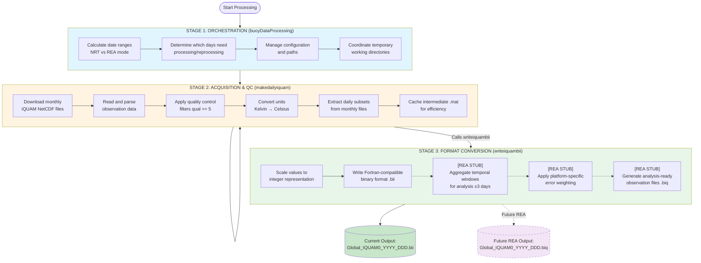

# IQUAM In-Situ SST Processing Module

## Overview

The IQUAM (in-situ SST Quality Monitor) module processes in-situ sea surface temperature observations from buoys, ships, and floats for assimilation into the Multi-scale Ultra-high Resolution (MUR) SST analysis system.

**Containerized Deployment:** This application is containerized using Docker with a multi-stage build process. See [CONTAINER_SETUP.md](CONTAINER_SETUP.md) for deployment instructions, volume mount specifications, and operational guidance.

### What This Module Produces

**Primary Output:** Daily binary files (`.bii` format) containing quality-controlled SST observations

**Processing Steps:**

1. **Download** monthly IQUAM NetCDF files from NOAA (~200-500 MB/month)
2. **Filter** observations by quality level (keep only `quality_level ≥ 5` - highest quality)
3. **Convert** units (Kelvin → Celsius) and time format (hour + minute → decimal hours)
4. **Extract** daily subsets from monthly files
5. **Reformat** to compact binary format (int16, scaled ×100 for 0.01° precision)
6. **Cache** monthly data as `.mat` files to avoid re-downloading

**Output Characteristics:**

- **Format:** Fortran-compatible binary (`.bii`)
- **Size:** ~1-10 MB per day (varies by observation density)
- **Content:** SST, lat/lon, time, platform type for ~400k-800k observations/day (post-QC)
- **Precision:** 0.01°C temperature, 0.01° coordinates, 0.01 hour time
- **Coverage:** Global ocean, all platform types

**Purpose:** These binary files provide the "ground truth" in-situ measurements that:

- Anchor satellite-derived SST to physical observations
- Fill gaps in regions with poor satellite coverage
- Enable bias detection and correction for satellite sensors
- Constrain the variational analysis solution

In-situ observations provide critical validation and constraints for satellite-derived SST products. These observations serve as "ground truth" measurements that:
- Anchor the analysis to physical observations with known accuracy
- Provide coverage in regions with poor satellite visibility (high cloud cover, high latitudes)
- Help detect and correct systematic biases in satellite sensors
- Contribute to uncertainty quantification and quality assurance

## Data Source

**Primary Provider:** NOAA Center for Satellite Applications and Research (STAR)
**Product:** iQUAM (in-situ SST Quality Monitor) Version 2.10
**Data Portal:** [https://www.star.nesdis.noaa.gov/pub/socd/sst/iquam/v2.10/](https://www.star.nesdis.noaa.gov/pub/socd/sst/iquam/v2.10/)
**Format:** NetCDF (GHRSST Level 2i specification)
**Temporal Coverage:** Near real-time + historical archive
**Update Frequency:** Monthly files updated daily

### What is iQUAM?

The iQUAM system is NOAA's operational quality monitoring system for in-situ SST measurements. It:
- Aggregates observations from multiple global networks (buoys, ships, floats)
- Applies comprehensive quality control checks (duplicate detection, track validation, spike detection, buddy checks)
- Flags erroneous, noisy, or suspect observations
- Provides quality metadata to enable user-defined filtering
- Maintains consistency across heterogeneous observation platforms

## Platform Types

The iQUAM dataset includes observations from multiple platform types, each with different characteristics and error properties:

| Type | Platform | Example Count* | Accuracy | Spatial Coverage |
|------|----------|----------------|----------|------------------|
| 1 | Ship | 105,781 | ±0.5-2.0°C | Major shipping routes |
| 2 | Drifting Buoy | 399,463 | ±0.2°C | Global ocean |
| 3 | Tropical Moored Buoy | 10,261 | ±0.1°C | Equatorial Pacific/Atlantic |
| 4 | Coastal Moored Buoy | 325,173 | ±0.2°C | Coastal regions |
| 5 | Argo Float | 4,406 | ±0.002°C | Global deep ocean |
| 6 | High-Res Drifter | 31,157 | ±0.1°C | Various regions |
| 7 | IMOS (Australia) | 37,442 | ±0.1°C | Australian waters |
| 8 | CRW Buoy | 9,047 | ±0.1°C | Coral reef monitoring |

**\*Note:** Example counts are from a single day (October 12, 2020 - day 286) documented in [platforms.txt](platforms.txt). Actual daily counts vary significantly by season, year, network operations, and data transmission success. Current observation counts may differ from these 2020 values.

## Code Structure

### Active Processing Pipeline (3 files)

1. **[buoyDataProcessing.m](buoyDataProcessing.m)** - Main orchestrator
   - Manages NRT/REA mode switching
   - Configurable paths via config struct
   - Contains stubs for future REA temporal aggregation

2. **[makedailyiquam.m](makedailyiquam.m)** - Daily processor
   - Downloads and processes monthly NetCDF files
   - Extracts daily observations
   - Calls writeiquambii() for output

3. **[writeiquambii.m](writeiquambii.m)** - Binary file writer
   - Writes .bii format files
   - Accepts configurable output directory

### Utility Functions (available but not called in pipeline)

4. **[readiquambii.m](readiquambii.m)** - Read .bii files for inspection/validation
5. **[refbii2biq.m](refbii2biq.m)** - REA temporal aggregation (needs refactoring, not yet integrated)

### Archived Files

Legacy and obsolete files have been moved to [archive/](archive/) directory. See [archive/README_ARCHIVE.md](archive/README_ARCHIVE.md) for details.

### Deployment

This application is deployed as a containerized service. See [CONTAINER_SETUP.md](CONTAINER_SETUP.md) for complete deployment instructions.

## Processing Pipeline

### Architecture

The IQUAM processing module operates as a three-stage pipeline:



**Note:** Dashed lines indicate REA mode functionality (Stage 3C-E) which is **stubbed but not yet implemented**. Currently, only NRT mode (.bii file generation) is operational.

### Processing Modes

The system operates in two distinct modes based on data maturity:

#### Near Real-Time (NRT) Mode **[CURRENTLY IMPLEMENTED]**
- **Latency:** 1 day behind current date
- **Purpose:** Provide rapid SST analysis for operational users
- **Characteristics:**
  - Uses most recent available data (may be incomplete)
  - No reprocessing of previous days (realtime flag = 1)
  - Faster execution (avoids re-downloads)
  - Outputs: Individual daily .bii files
  - May include provisional/uncorrected observations

#### Reanalysis (REA) Mode **[STUBBED - NOT YET IMPLEMENTED]**
- **Latency:** 4 days behind current date
- **Purpose:** Generate high-quality, stable SST records with temporal aggregation
- **Characteristics:**
  - Waits for data consolidation and delayed transmission
  - Applies 2-day stability window before reprocessing
  - Allows corrections from data providers to propagate
  - **[Future]** Aggregates ±3 day temporal windows (refbii2biq.m)
  - **[Future]** Applies platform-specific error weighting
  - **[Future]** Outputs: Aggregated .biq files for analysis
  - Higher data completeness and quality

The system automatically processes a **9-day sliding window** to cover both modes, ensuring continuous production while maintaining data quality standards. REA temporal aggregation functionality is designed but not yet active (see [buoyDataProcessing.m:238-263](buoyDataProcessing.m#L238-L263) for stub).

## Quality Control Strategy

### Multi-Layer Quality Assessment

The iQUAM data undergoes quality control at multiple stages:

#### 1. Source-Level QC (NOAA STAR)
Before data reaches this module, NOAA applies:
- **Duplicate Detection:** Identifies identical observations from multiple reporting paths
- **Track Check:** Validates platform position consistency over time
- **Geolocation Check:** Ensures coordinates are physically plausible
- **SST Spike Check:** Detects unrealistic temperature jumps
- **Buddy Check:** Compares observation against 6+ nearby measurements
- **Gross Error Probability:** Statistical outlier detection

#### 2. Module-Level Filtering (This Code)
Current implementation applies:
```
Primary Filter: quality_level >= 5
```

This removes:
- Erroneous observations (quality_level = 1)
- Noisy observations (quality_level = 2)
- Observations without QC metadata (quality_level = 3)
- Low-confidence observations (quality_level = 4)

#### 3. Analysis-Level Weighting (Downstream)
During variational analysis, observations receive platform-specific error weights:
- Ships: σ = 2.0°C (higher uncertainty due to measurement methodology)
- Buoys: σ = 0.5°C (typical for well-calibrated platforms)
- Floats: σ = 0.2°C (high-precision instruments)

These weights influence each observation's contribution to the final SST field.

### Quality Flag Encoding

The 16-bit quality flag provides detailed diagnostic information:

**Bits 0-1: Overall Quality**
- `00` (0) = Normal
- `01` (1) = Erroneous
- `10` (2) = Noisy
- `11` (3) = QC Unavailable

**Bits 2-3: Duplicate Status**
- `00` = No duplicate found
- `01` = Duplicate kept (this record)
- `10` = Duplicate removed

**Bit 4: Track/Geolocation Check**
- `0` = Passed (position consistent with platform track)
- `1` = Failed (suspicious position)

**Bit 5: SST Spike Check**
- `0` = Passed (temperature change within expected range)
- `1` = Failed (unrealistic temperature jump)

**Bit 6: Platform ID Validity**
- `0` = Valid platform identifier
- `1` = Invalid or unknown identifier

**Bit 7: Buddy Check Density**
- `0` = 6 or more nearby observations available for validation
- `1` = Fewer than 6 buddies (less confident validation)

**Bits 8-15: Probability of Gross Error**
- Value = 0-255 (scaled from 0.0 to 1.0)
- Higher values indicate greater likelihood of measurement error

**Important:** Quality control is only applied to SST measurements. Other variables (wind speed, air temperature, pressure) pass through unfiltered and should be used with caution.

## Data Flow and Transformations

### Input: Monthly NetCDF Files

```
Source File: YYYYMM-STAR-L2i_GHRSST-SST-iQuam-GLOBALOCEAN-v02.0-fv01.0.nc
Size: ~500 MB (monthly, global)
Variables:
  - time: observation timestamp (seconds since reference)
  - lat: latitude (-90 to 90°)
  - lon: longitude (-180 to 180°)
  - sea_surface_temperature: SST in Kelvin
  - quality_level: composite quality flag (1-5)
  - platform_type: observation platform (1-8)
  - [additional variables not currently used]
```

### Transformation Steps

#### 1. Monthly to Daily Extraction
- **Why:** MUR analysis runs on a daily cycle
- **How:** Filter by calendar day from monthly file
- **Temporal Window:** Extract ±3 days from analysis day (captures temporal continuity)

#### 2. Unit Conversion
- **Temperature:** Kelvin → Celsius (subtract 273.15)
- **Rationale:** Analysis algorithms work in Celsius; ice point = 0°C
- **Validation:** Check SST > -2°C (below freezing point) and < 40°C (maximum realistic value)

#### 3. Time Normalization
- **Original:** Separate hour, minute fields
- **Converted:** Decimal hours (hour + minute/60)
- **Purpose:** Simplifies temporal weighting in analysis (distance from 09:00 UTC analysis time)

#### 4. Spatial Coordinate Handling
- **Longitude Convention:** -180° to +180° (consistent with MUR grid)
- **Scaling:** All coordinates scaled by 100 and stored as int16 (precision: 0.01°)
- **Reason:** Reduces file size by 75% while maintaining adequate precision

### Output: Daily Binary Files

```
Output File: /nas2/iquam/YYYY/Global_IQUAM0_YYYY_DDD.bii
Size: ~1-10 MB (daily, global)
Format: Fortran unformatted binary (int16 precision)
Structure:
  Header:
    - N: number of observations (int32)
    - year: year (int16)
    - day: day of year (int16)
  Data Arrays (N elements each):
    - sst: temperature in Celsius × 100 (int16)
    - lon: longitude × 100 (int16)
    - lat: latitude × 100 (int16)
    - hour: decimal hours × 100 (int16)
    - platform_type: platform code (int8)
```

**File Naming Convention:**
- `Global`: spatial domain (entire Earth)
- `IQUAM0`: dataset identifier (in-situ observations, version 0)
- `YYYY`: four-digit year
- `DDD`: three-digit day of year (001-366)
- `.bii`: Binary IQUAM Instrument format

### Aggregation for Analysis **[FUTURE REA MODE]**

**Current Implementation:** Daily .bii files are processed independently with no temporal aggregation.

**Planned Implementation:** For each analysis day, observations from a **7-day window** (±3 days) would be aggregated:

**Why a temporal window?**
1. **Temporal Persistence:** SST changes slowly (typical: 0.1-0.5°C/day)
2. **Spatial Coverage:** Many ocean regions have sparse daily observations
3. **Synoptic Analysis:** Capture mesoscale features that evolve over days
4. **Error Reduction:** More observations → better constrained solution

**Temporal Weighting (when implemented):**
Observations farther from analysis time would receive lower weight based on:
- Time difference (decay function)
- Expected SST persistence (varies by location, season)
- Platform measurement uncertainty

**Implementation Status:** The aggregation functionality ([refbii2biq.m](refbii2biq.m)) exists but needs refactoring to accept configurable paths. See stub at [buoyDataProcessing.m:238-263](buoyDataProcessing.m#L238-L263).

## Integration with MUR Analysis

### Role in Multi-Scale Variational Analysis (MRVA)

In-situ observations serve multiple purposes in the MUR system:

#### 1. Reference Field Generation
- **Purpose:** Create initial SST estimate before satellite assimilation
- **Why In-Situ First:** Independent of satellite biases; direct measurement
- **Method:** Spatial interpolation of buoy network using coarse-resolution analysis (L=2-7, ~4-250 km)
- **Coverage:** Sparse but globally distributed; strong constraints near coast/islands

#### 2. Bias Detection and Correction
- **Comparison:** Satellite observations vs. collocated in-situ measurements
- **Detection:** Systematic differences indicate sensor calibration drift
- **Application:** Compute and apply bias corrections to satellite data
- **Sensors:** Primarily applied to infrared sensors (MODIS, AVHRR) which are more prone to atmospheric contamination

#### 3. Data Assimilation
- **Framework:** Observations used as constraints in variational analysis cost function
- **Weight:** Based on platform-specific error characteristics
- **Contribution:** Greatest impact in data-sparse regions and near coasts

#### 4. Validation and Quality Assurance
- **Independent Check:** Compare final MUR SST against withheld in-situ observations
- **Metrics:** RMS error, bias, correlation
- **Monitoring:** Track analysis performance over time

### Temporal Integration

The MRVA algorithm uses a **temporal decay function** to weight observations:

```
Weight(t) = W₀ × exp(-Δt² / τ²)

Where:
  W₀ = base weight (from platform error estimate)
  Δt = time difference from analysis hour (09:00 UTC)
  τ = decay time constant (varies by scale: 12-48 hours)
```

**Scale-Dependent Decay:**
- Coarse scales (L=2-4, ~4-16 km): τ = 48 hours (slow SST evolution)
- Medium scales (L=5-8, ~32-256 km): τ = 36-24 hours
- Fine scales (L=9-11, ~512-2048 km): τ = 12-18 hours (fast evolution)

This approach allows the system to:
- Use older observations for large-scale features (stable over days)
- Rely on recent observations for small-scale features (evolve rapidly)
- Gracefully handle gaps in satellite coverage

## Configuration and Tuning

### Key Parameters

#### Date Range Control ([buoyDataProcessing.m](buoyDataProcessing.m))

The function uses MATLAB's modern `arguments` block for parameter validation. All parameters are optional and have sensible defaults. Parameters are passed as individual positional arguments (not as a struct).

**Parameter List (in order):**

```matlab
buoyDataProcessing(workDir, logDir, outputDir, cacheDir, sourceUrl, ...
                   enableREA, testing, nrtLatency, reaLatency, ...
                   scanLatency, buoyDayRange, buoyStabilityLatency, ...
                   reaAggregationWindow, reaOutputDir)
```

| Parameter | Default | Description |
|-----------|---------|-------------|
| `workDir` | `'./tmp/makebic'` | Temporary working directory |
| `logDir` | `'./logs'` | Directory for log files |
| `outputDir` | `'./output/iquam'` | Root directory for output .bii files |
| `cacheDir` | `'./cache/iquam'` | Cache directory for monthly .mat files |
| `sourceUrl` | `'https://www.star.nesdis.noaa.gov/pub/socd/sst/iquam/v2.10/'` | URL for IQUAM NetCDF downloads |
| `enableREA` | `'false'` | Enable REA mode (string: 'true' or 'false') |
| `testing` | `'0'` | Testing mode flag (string: '0' or '1') |
| `nrtLatency` | `'1'` | Days behind current for NRT processing |
| `reaLatency` | `'4'` | Days behind current for reanalysis |
| `scanLatency` | `'9'` | Days to scan backward (total window) |
| `buoyDayRange` | `'3'` | Temporal window for observation aggregation (±days) |
| `buoyStabilityLatency` | `'2'` | Stability latency before allowing reprocessing |
| `reaAggregationWindow` | `'3'` | REA temporal aggregation window (±days) |
| `reaOutputDir` | `'./output/iquam_rea'` | Output directory for .biq files (REA mode) |

**Note:** When calling from command-line or Docker, all parameters must be passed as strings. The function automatically converts numeric parameters from strings.

**Tuning Guidance:**
- Increase `nrtLatency` if data transmission delays are observed
- Increase `reaLatency` if delayed corrections are common
- Adjust `buoyDayRange` based on data density and SST variability
- Set `buoyStabilityLatency` to balance data quality vs. reprocessing frequency
- Set `enableREA = 'true'` when REA aggregation is implemented

**Usage Examples:**

```matlab
% 1. Use all defaults
buoyDataProcessing()

% 2. Override first few parameters (leave rest as defaults)
buoyDataProcessing('./tmp/work', './logs', '/data/output/iquam')

% 3. Override specific parameters by position
buoyDataProcessing('./tmp/makebic', './logs', './output/iquam', ...
                   './cache/iquam', ...
                   'https://www.star.nesdis.noaa.gov/pub/socd/sst/iquam/v2.10/', ...
                   'true', '0', '1', '4', '9', '3', '2', '3', './output/iquam_rea')

% 4. From compiled executable (command-line)
% ./IquamProcessor  # Uses all defaults

% 5. From compiled executable with custom paths
% ./IquamProcessor /tmp/work /logs /output/iquam /cache/iquam
```

**Docker Usage:**

```bash
# Use all defaults (container paths from volume mounts)
docker run --rm \
  -v /host/output:/data/output/iquam \
  -v /host/cache:/data/cache/iquam \
  -v /host/logs:/data/logs \
  iquam:latest

# Override specific parameters
docker run --rm \
  -v /host/output:/data/output/iquam \
  -v /host/cache:/data/cache/iquam \
  -v /host/logs:/data/logs \
  iquam:latest \
  /tmp/makebic /data/logs /data/output/iquam /data/cache/iquam \
  https://www.star.nesdis.noaa.gov/pub/socd/sst/iquam/v2.10/ \
  false 1 1 4 9 3 2 3 /data/output/iquam_rea
```

**Important Notes:**
- MATLAB's `arguments` block allows partial argument lists - you can provide only the first N parameters and the rest use defaults
- When calling from Docker/command-line, you must provide arguments in order (you cannot skip middle parameters)
- To change a late parameter (e.g., `buoyStabilityLatency`), you must provide all preceding parameters
- For maximum flexibility with Docker, consider using environment variables or a configuration file

#### Quality Thresholds ([makedailyiquam.m:75](makedailyiquam.m#L75))

```matlab
qual >= 5    % Current: accept only highest quality
```

**Alternative Filters:**
```matlab
% Option 1: Accept Normal + Noisy (more observations, possibly noisier)
qual >= 3

% Option 2: iQUAM recommended filter (Normal quality only)
mod(qual, 4) == 0

% Option 3: Combine overall quality + buddy check
(mod(qual, 4) == 0) & (bitand(qual, 128) == 0)
```

#### Platform Error Estimates ([refbii2biq.m](refbii2biq.m))

```matlab
Platform Type    Default RMS    Recommended Range
---------------------------------------------------
Ships            2.0°C          1.5 - 3.0°C
Buoys/Floats     0.5°C          0.3 - 0.7°C
High-Precision   0.2°C          0.1 - 0.4°C
```

**Tuning Guidance:**
- Decrease error for well-maintained networks (gives them more weight)
- Increase error for suspect platforms or high-variability regions
- Validate against independent SST analysis or satellite matchups

### Output Directories

**Default Configuration (container-friendly relative paths):**
```
./output/iquam/
└── YYYY/
    ├── Global_IQUAM0_YYYY_001.bii    # Daily binary files
    ├── Global_IQUAM0_YYYY_002.bii
    ├── ...
    └── Global_IQUAM0_YYYY_366.bii

./cache/iquam/
├── iquam.2023.01.mat                  # Monthly NetCDF cache
├── iquam.2023.02.mat
└── ...

./tmp/makebic/
└── [temporary working files, auto-cleaned at startup]

./logs/
└── buoy.log                           # Processing log (appended)
```

**Legacy Configuration (absolute paths):**
For backward compatibility, can configure absolute paths:
```matlab
config.outputDir = '/nas2/iquam';
config.logDir = '/home/tmchin/logs';
buoyDataProcessing(config)
```

**Deployment:**
The application runs in a containerized environment. See [CONTAINER_SETUP.md](CONTAINER_SETUP.md) for volume mount specifications and configuration options.

## Data Quality and Validation

### Expected Data Characteristics

**Typical Daily Counts:**
- Total observations: 500,000 - 900,000 globally
- After QC filtering: 400,000 - 800,000 (70-90% pass rate)
- Spatial distribution: Heavily weighted to Northern Hemisphere, shipping routes, coastal regions

**Temporal Variability:**
- Higher counts in Northern Hemisphere summer (better transmission conditions)
- Lower counts during major storms (buoy damage/loss)
- Gradual trends due to network expansion/contraction

**Known Gaps:**
- Southern Ocean (sparse coverage)
- Remote tropical regions (few platforms)
- Polar regions (ice coverage, no platforms)

### Quality Assurance Checks

#### 1. Count Monitoring
```matlab
% Check daily observation count
if N < 200000
    warning('Low observation count - possible data availability issue')
end
```

#### 2. Spatial Coverage
```matlab
% Check for data in major ocean basins
basins = {'North Atlantic', 'North Pacific', 'Tropical Pacific', ...};
for basin in basins
    if count(basin) < threshold
        warning(['Sparse coverage in ' basin])
    end
end
```

#### 3. Temperature Range Validation
```matlab
% Physical validity checks
assert(all(sst >= -2.0), 'SST below freezing point')
assert(all(sst <= 40.0), 'SST exceeds maximum realistic value')
assert(std(sst) > 0.5 & std(sst) < 10, 'Unexpected SST variance')
```

#### 4. Platform Distribution
```matlab
% Ensure multiple platform types present
platform_counts = histcounts(platform_type, 1:9);
assert(sum(platform_counts > 0) >= 4, 'Insufficient platform diversity')
```

## Operational Considerations

### Execution Environment

**Software Dependencies:**
- MATLAB R2021b+ (NetCDF reading, binary I/O, orchestration)
- wget (data download)
- Network access to NOAA STAR servers

**Computational Resources:**
- Memory: ~2 GB per daily process (monthly NetCDF in memory)
- Disk: ~500 MB temporary per day, ~5 MB permanent output per day
- Disk (cache): ~100 MB per month for .mat cache files
- CPU: Minimal (I/O bound, not compute intensive)
- Network: ~50-200 MB download per month (NetCDF files, cached after first download)

### Performance Optimization

#### Caching Strategy
Monthly NetCDF files are cached as MATLAB `.mat` files:
- **First access:** Download + process (slow, ~2-5 minutes)
- **Subsequent access:** Load from cache (fast, ~10-30 seconds)
- **Cache invalidation:** Automatic after 2-day stability window

#### Conditional Reprocessing
The system avoids unnecessary work by:
- Checking output file existence before processing
- Comparing file timestamps against stability latency
- Only reprocessing when `rewrite=1` or data is unstable

#### Parallel Opportunities
Currently sequential, but could parallelize:
- Multiple days can be processed independently
- Different months can be downloaded simultaneously
- Daily extraction and QC could be threaded

**Typical Runtime:**
- First run (cold cache): ~3-5 minutes per day
- Subsequent runs (warm cache): ~30-60 seconds per day
- Full 9-day window: ~15-30 minutes total

### Error Handling and Recovery

#### Common Failure Modes

**1. Network Interruption**
- **Symptom:** wget fails, incomplete download
- **Recovery:** Script retries on next execution (wget resumes partial downloads)
- **Prevention:** Increase timeout, check network stability

**2. Missing Monthly File**
- **Symptom:** NetCDF file not found at source URL
- **Cause:** NOAA processing delay, server maintenance
- **Recovery:** Wait 24 hours, data typically appears with delay
- **Mitigation:** NRT mode can skip and continue; REA mode should retry

**3. Corrupted NetCDF**
- **Symptom:** MATLAB netcdf.open() error
- **Recovery:** Delete cached `.mat` file from cacheDir, re-run with rewrite flag
- **Command:** `makedailyiquam(year, doy, 1, outputDir, cacheDir, sourceUrl)` with rewrite=1

**4. Disk Space Exhaustion**
- **Symptom:** Write errors, incomplete output files
- **Prevention:** Monitor outputDir, cacheDir, and workDir usage
- **Recovery:** Clean old cache files, increase quota, or adjust mount sizes

**5. Zero Observations After QC**
- **Symptom:** Output file has N=0 header
- **Cause:** All observations failed quality filter
- **Recovery:** Lower quality threshold temporarily, investigate data quality issue
- **Note:** Rare but possible during network outages or data provider issues

#### Logging and Diagnostics

All operations logged to `<logDir>/buoy.log` (default: `./logs/buoy.log`):
```
---------- Today = Year 2025 Day 295 ----------
           from (2025,286) to (2025,294)
  ======== Final run for Year 2025 Day 286 ========
Processing year=2025 day=286 rewrite=0
makedailyiquam: reading ./cache/iquam/iquam.2025.10.mat
  ======== Interim run for Year 2025 Day 294 ========
Processing year=2025 day=294 rewrite=1
[wget output showing YYYYMM-STAR-L2i_GHRSST-SST-iQuam-GLOBALOCEAN-v02.0-fv01.0.nc download]
[REA STUB] Would aggregate temporal window for analysis day 2025/286
```

**Key Log Patterns:**
- `Interim run` - NRT mode (recent, unstable data)
- `Final run` - REA mode (older, stable data)
- `keeping old` - File exists, not reprocessing
- `rewrite=1` - Force reprocessing
- `[REA STUB]` - REA aggregation point (not yet implemented)

**Key Metrics to Monitor:**
- Download success rate
- Observation count trends (check file sizes)
- Processing time per day
- Disk usage growth in outputDir and cacheDir

## Future Improvements and Considerations

### Potential Enhancements

#### 1. Adaptive Quality Filtering
- **Current:** Fixed threshold (qual >= 5)
- **Proposed:** Region-dependent, season-dependent thresholds
- **Benefit:** Optimize data retention vs. quality tradeoff

#### 2. Platform-Specific Processing
- **Current:** Uniform processing for all platforms
- **Proposed:** Specialized handling for high-precision platforms (Argo, IMOS)
- **Benefit:** Better utilize accuracy of premium observations

#### 3. Real-Time Monitoring Dashboard
- **Proposed:** Web interface showing:
  - Daily observation counts by platform
  - Spatial coverage maps
  - QC statistics and trends
  - Processing status and errors
- **Benefit:** Faster detection and response to data issues

#### 4. Alternative Data Sources
- **Current:** NOAA iQUAM only
- **Proposed:** Direct feeds from:
  - NDBC (National Data Buoy Center) - lower latency
  - IMOS (Integrated Marine Observing System) - high precision
  - Argo GDAC (Global Data Assembly Center) - float profiles
- **Benefit:** Increased data volume, reduced latency, enhanced quality

#### 5. Machine Learning QC
- **Proposed:** Train ML models to detect subtle quality issues:
  - Calibration drift
  - Sensor fouling
  - Position errors
- **Benefit:** Catch errors missed by traditional QC algorithms

### Known Limitations

#### 1. Month Boundary Handling
- **Issue:** Daily extraction from monthly files at month boundaries (e.g., Jan 1 needs Dec data)
- **Current:** May miss observations near midnight UTC
- **Impact:** Minimal (few observations exactly at boundary)
- **Solution:** Download and process adjacent months at boundaries

#### 2. Data Latency Variability
- **Issue:** Different platforms have different reporting latencies:
  - Drifting buoys: 1-3 hours
  - Ships: 3-12 hours
  - Delayed-mode Argo: 1-6 months
- **Current:** Fixed 2-day stability window for all platforms
- **Impact:** May reprocess unnecessarily or miss delayed corrections
- **Solution:** Platform-specific latency configuration

#### 3. Error Correlation
- **Assumption:** Observation errors are independent
- **Reality:** Systematic biases can affect platform groups (e.g., ship network, regional buoy network)
- **Impact:** Analysis may underestimate uncertainty in regions dominated by one platform type
- **Solution:** Implement spatial error correlation in MRVA

#### 4. No Vertical Context
- **Current:** Surface SST only (buoy/ship hull depth: 0.5-5 meters)
- **Missing:** Subsurface temperature structure
- **Impact:** Cannot detect shallow stratification or near-surface gradients
- **Solution:** Integrate Argo temperature profiles (available but not currently used)

## References and Documentation

### External Resources

**NOAA iQUAM Documentation:**
- Product Guide: [https://www.star.nesdis.noaa.gov/sod/sst/iquam/](https://www.star.nesdis.noaa.gov/sod/sst/iquam/)
- Quality Flag Specification: [https://www.star.nesdis.noaa.gov/sod/sst/iquam/iquam_qc.html](https://www.star.nesdis.noaa.gov/sod/sst/iquam/iquam_qc.html)
- Version History: [https://www.star.nesdis.noaa.gov/sod/sst/iquam/versions.html](https://www.star.nesdis.noaa.gov/sod/sst/iquam/versions.html)

**GHRSST Specifications:**
- Data Specification v2.0: [https://www.ghrsst.org/ghrsst-data-services/products/](https://www.ghrsst.org/ghrsst-data-services/products/)
- In-Situ SST Best Practices: [https://www.ghrsst.org/ghrsst-science/sst-definitions/](https://www.ghrsst.org/ghrsst-science/sst-definitions/)

**Platform Networks:**
- Global Drifter Program: [https://www.aoml.noaa.gov/phod/gdp/](https://www.aoml.noaa.gov/phod/gdp/)
- Tropical Atmosphere Ocean (TAO): [https://www.pmel.noaa.gov/tao/](https://www.pmel.noaa.gov/tao/)
- Argo Float Program: [https://argo.ucsd.edu/](https://argo.ucsd.edu/)
- NDBC Buoy Network: [https://www.ndbc.noaa.gov/](https://www.ndbc.noaa.gov/)

### Citation

If using MUR SST data or this processing system in publications, please cite:

> Chin, T. M., J. Vazquez-Cuervo, and E. M. Armstrong (2017), A multi-scale high-resolution analysis of global sea surface temperature, *Remote Sensing of Environment*, 200, 154-169, doi:10.1016/j.rse.2017.07.029

For iQUAM data specifically:

> Xu, F., and A. Ignatov (2014), In situ SST Quality Monitor (iQuam), *Journal of Atmospheric and Oceanic Technology*, 31(1), 164-180, doi:10.1175/JTECH-D-13-00121.1