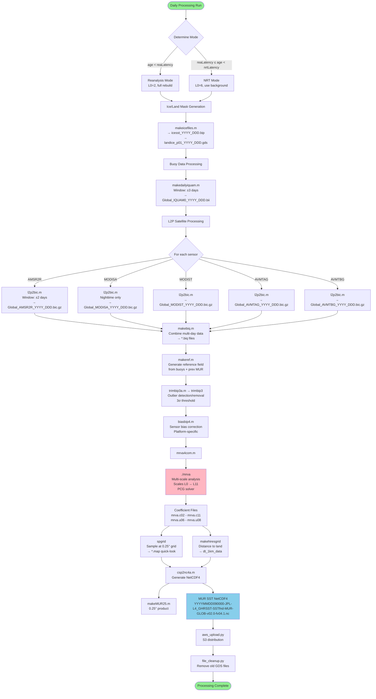

# MRVA Developer Overview

**Multi-Resolution Variational Analysis (MRVA) System**
**MUR SST Processing Pipeline - Technical Documentation**

---

## Table of Contents

1. [Introduction](#introduction)
2. [System Architecture](#system-architecture)
3. [Code Organization](#code-organization)
4. [Processing Pipeline](#processing-pipeline)
5. [Core Components Deep Dive](#core-components-deep-dive)
6. [File Formats and Data Structures](#file-formats-and-data-structures)
7. [Algorithm Implementation Details](#algorithm-implementation-details)
8. [Configuration and Parameters](#configuration-and-parameters)
9. [Developer Workflows](#developer-workflows)
10. [Performance and Optimization](#performance-and-optimization)
11. [References](#references)

---

## Introduction

This document provides a comprehensive technical overview of the MRVA (Multi-Resolution Variational Analysis) system used to generate the Multi-scale Ultra-high Resolution (MUR) Sea Surface Temperature (SST) product. It is intended for developers who need to understand, maintain, modify, or extend the MRVA codebase.

### What is MRVA?

MRVA is a hierarchical variational data assimilation algorithm that produces daily global SST analyses at 1km resolution by:

1. **Multi-scale processing**: Progressively refining from coarse (~1250km) to fine (~1km) scales
2. **Multi-sensor fusion**: Optimally combining satellite (microwave, infrared), in-situ (buoys), and ice model data
3. **Variational optimization**: Balancing data fidelity against smoothness constraints
4. **Spline representation**: Using cubic B-spline basis functions for continuous field representation

### Key Product Characteristics

- **Spatial Resolution**: 1km (0.01°) global grid
- **Temporal Resolution**: Daily analysis at 09:00 UTC
- **Coverage**: Global ocean (-180° to 180°, -90° to 90°)
- **Latency**: 1-day (NRT mode) to 4-day (Reanalysis mode)
- **Output Format**: GHRSST-compliant NetCDF4

---

## System Architecture

### Three-Layer Architecture

The MRVA system follows a three-layer architecture combining Python orchestration, MATLAB data processing, and Fortran numerical computation:

```
┌─────────────────────────────────────────────────────────────┐
│                   Python Orchestration Layer                │
│  - nrt_processor.py: Main NRT workflow coordinator          │
│  - mrva_runner.py: MATLAB/Fortran execution wrapper         │
│  - aws_upload.py: S3 distribution                           │
│  - file_cleanup.py: Data lifecycle management               │
└─────────────────────────────────────────────────────────────┘
                              ↓
┌─────────────────────────────────────────────────────────────┐
│                MATLAB Data Processing Layer                  │
│  Preprocessing:                                              │
│  - makeicefiles.m: Ice/land mask generation                 │
│  - makedailyiquam.m: Buoy data extraction                   │
│  - l2p2bic.m: Satellite L2P → BIC conversion                │
│  - makebiq.m: Combine sensors → BIQ format                  │
│                                                              │
│  MRVA Workflow:                                              │
│  - mrva4com.m: Main MRVA orchestrator                       │
│  - makeref.m: Reference field generation                    │
│  - trimbip3a.m: Outlier detection/removal                   │
│  - biasbip4.m: Bias correction                              │
│                                                              │
│  Output Generation:                                          │
│  - csp2nc4a.m: CSP coefficients → NetCDF4                   │
│  - makeMUR25.m: 0.25° product generation                    │
└─────────────────────────────────────────────────────────────┘
                              ↓
┌─────────────────────────────────────────────────────────────┐
│              Fortran Numerical Computation Layer             │
│  Core Algorithms:                                            │
│  - mrva.f: Multi-scale variational analysis (PCG solver)    │
│  - spgrid.f: Spline coefficient → gridded field             │
│                                                              │
│  Preprocessing Tools:                                        │
│  - trimbip3.f: Data filtering/trimming                      │
│  - prepbip.f: Binary file preparation                       │
│  - makehiresgrid.f: Distance-to-land grid                   │
│                                                              │
│  Utilities:                                                  │
│  - filemod.f: Fortran file I/O module                       │
│  - spmm.f: Sparse matrix module                             │
└─────────────────────────────────────────────────────────────┘
```

## Processing Pipeline

### End-to-End Processing Flow



### Processing Modes

#### Reanalysis (REA) Mode

**Trigger**: `(today - analysis_day) >= reaLatency` (default: 4 days)

**Characteristics**:
- Starts from coarse scale: `L0 = 2` (~1250km)
- No background initialization (build from scratch)
- All sensor data fully stable
- Rewrites all intermediate files
- Longer processing time (~4-6 hours)
- Higher accuracy, complete data coverage

**Use Case**: Final quality products for archival/climate studies

#### Near Real-Time (NRT) Mode

**Trigger**: `reaLatency <= (today - analysis_day) < nrtLatency` (default: 1 day)

**Characteristics**:
- Starts from medium scale: `L0 = 6` (~78km)
- Uses previous day's L=6 coefficients as background
- Some sensor data may still update
- Skips stable data rewrites (caching)
- Faster processing (~1-2 hours)
- Timely product delivery

**Use Case**: Operational forecasting, near real-time applications

### Daily Processing Timeline

**Example: Processing Day 99 on Day 100**

```
Time: 00:00 - 06:00 UTC (Day 100)
├─ Hourly L2P downloads (PO.DAAC Data Subscriber cron jobs)
│  ├─ :00 - AMSR2 standard
│  ├─ :10 - AMSR2 real-time
│  ├─ :20 - AVHRR MetOp-B
│  ├─ :30 - MODIS Aqua
│  └─ :40 - MODIS Terra

Time: 06:00 - 08:00 UTC
├─ Ice data download (OSI-SAF)
└─ iQUAM monthly file update

Time: 08:00 - 10:00 UTC
└─ Main MRVA processing run (nrt_processor.py)
   ├─ Ice/land mask generation (5 min)
   ├─ Buoy processing (10 min)
   ├─ L2P processing all sensors (40 min)
   ├─ MRVA analysis (45 min)
   └─ NetCDF generation (20 min)

Time: 10:00 - 11:00 UTC
├─ S3 upload (aws_upload.py)
└─ PO.DAAC distribution

Time: 11:00+ UTC
└─ File cleanup (file_cleanup.py)
```

---

## Core Components Deep Dive

### 1. Python Orchestration Layer

#### nrt_processor.py

**Purpose**: Main production NRT workflow coordinator

**Key Functions**:

```python
# Date range calculation
nrtLatency = 1   # Process yesterday's data
reaLatency = 4   # Reanalysis cutoff
scanLatency = 9  # How far back to scan

# Sensor configuration
sensors = (
    ('AMSR2R', '/nas2/bic/AMSR2R', 'Global', 2, 8, 2, 2),
    #  name     output_dir           region  La Lb dayrange stablat
)

# Processing loop (simplified)
for day in date_range:
    mode = 'nrt' if (today - day) < reaLatency else 'rea'

    # 1. Ice/land masks
    run_matlab('makeicefiles.m', year, day)

    # 2. Buoy data
    run_matlab('makedailyiquam.m', year, day, dayrange=3)

    # 3. L2P sensors
    for sensor in sensors:
        run_matlab('l2p2bic.m', sensor, year, day, dayrange=2)

    # 4. MRVA analysis
    run_matlab('mrva4com.m', year, day, mode)

    # 5. NetCDF output
    run_matlab('csp2nc4a.m', year, day)
```

**Configuration Parameters**:

| Parameter | Default | Purpose |
|-----------|---------|---------|
| `nrtLatency` | 1 day | NRT processing lag |
| `reaLatency` | 4 days | REA mode cutoff |
| `scanLatency` | 9 days | Processing window start |
| `buoydayrange` | 3 days | Buoy temporal window (±3) |
| `buoystablat` | 2 days | Buoy data stability latency |

**Sensor Parameters** (La, Lb, dayrange, stablat):

```python
('AMSR2R', 2, 8,  2, 2)  # Microwave, coarse resolution
('MODISA', 2, 12, 2, 2)  # Infrared high-res, standard latency
('MODIST', 2, 12, 2, 3)  # Infrared high-res, longer latency
('AVMTAG', 2, 9,  2, 2)  # AVHRR medium-res
('AVMTBG', 2, 9,  2, 2)  # AVHRR medium-res
```

Where:
- `La`: Minimum scale for sensor contribution
- `Lb`: Maximum scale for sensor contribution
- `dayrange`: Temporal window (±days)
- `stablat`: Days until data is stable (cache vs rewrite)

### 2. MATLAB Processing Layer

#### mrva4com.m - Main MRVA Orchestrator

**Purpose**: Coordinates the complete MRVA workflow from BIQ files to coefficient output

**Algorithm**:

```matlab
% 1. Configuration
L0 = 2;  % Start scale (REA) or 6 (NRT)
LF = 11; % Final scale
outL = 10;   % Output sampling scale (1km)
outL4 = 11;  % L4 product scale

% 2. Define sensors and parameters
refdata = {'IQUAM0', '/nas2/iquam', 'Global', 0, 6, 3};
sensors = {
    {'IQUAM0',  '/nas2/iquam',       'Global', 0, 6,  3},
    {'AMSR2R',  '/nas2/bic/AMSR2R',  'Global', 2, 8,  2},
    {'MODISA',  '/nas2/bic/MODISA',  'Global', 2, 12, 2},
    {'MODIST',  '/nas2/bic/MODIST',  'Global', 2, 12, 2},
    {'AVMTAG',  '/nas2/bic/AVMTAG',  'Global', 2, 9,  2},
    {'AVMTBG',  '/nas2/bic/AVMTBG',  'Global', 2, 9,  2},
    {'icesst',  '/nas2/gds',         'Global', 2, 9,  0}
};

% 3. Scale-dependent decay times (hours)
decaytimes = [48, 48, 48, 48, 48, 48, 42, 36, 30, 24, 18, 12];
%             L2  L3  L4  L5  L6  L7  L8  L9 L10 L11 L12 L13

% 4. Generate namelist
write_namelist('mrva.nml', L0, LF, sensors, decaytimes, ...);

% 5. Execute Fortran MRVA
system('./mrva < mrva.nml');

% 6. Post-processing
%    - Read coefficient files (mrva.c02 - mrva.c11)
%    - Generate map files for quick-look
%    - Compute diagnostics
```

**Key Responsibilities**:
1. Build sensor file lists with temporal windows
2. Configure scale-dependent parameters
3. Write Fortran namelist file
4. Execute `mrva` Fortran executable
5. Verify output coefficient files

#### makebiq.m - Multi-Day Data Combination

**Purpose**: Combine individual daily sensor files (BIC, BII, BIN) into multi-day BIQ files with temporal offsets

**Algorithm**:

```matlab
function makebiq(sensor, region, year, day, dayrange)
% Inputs:
%   sensor   - Sensor name (e.g., 'MODISA')
%   region   - Region name (e.g., 'Global')
%   year, day - Analysis date
%   dayrange - Temporal window (±days)

% 1. Initialize storage
all_lon = [];
all_lat = [];
all_sst = [];
all_std = [];
all_dhr = [];  % Time offset in hours

% 2. Loop over temporal window
for d = (day - dayrange):(day + dayrange)

    % Read daily file (BIC format)
    filename = sprintf('%s_%s_%04d_%03d.bic.gz', region, sensor, year, d);
    [lon, lat, sst, std, hour] = readbicgz(filename);

    % Compute temporal offset from analysis time (09:00 UTC)
    analysis_time = 9.0;  % hours
    dhr = hour - analysis_time + (d - day) * 24.0;

    % Accumulate
    all_lon = [all_lon; lon];
    all_lat = [all_lat; lat];
    all_sst = [all_sst; sst];
    all_std = [all_std; std];
    all_dhr = [all_dhr; dhr];
end

% 3. Write combined BIQ file
filename_out = sprintf('%s_%s_%04d_%03d.biq', region, sensor, year, day);
writebiq(filename_out, all_lon, all_lat, all_sst, all_std, all_dhr);
```

**Key Insight**: The temporal offset `dhr` is critical for MRVA's Gaussian temporal weighting:
```
weight = (1/std^2) * exp(-(dhr/decay)^2)
```

#### trimbip3a.m - Outlier Detection/Removal

**Purpose**: Remove outlier observations that deviate significantly from reference field

**Algorithm**:

```matlab
% 1. Read input data
[lon, lat, sst, std, dhr] = readbiq(input_file);

% 2. Read reference field (from makeref.m)
[ref_sst, ref_grid] = readcsp(reference_file);

% 3. Interpolate reference to observation locations
ref_interp = interp_spline(ref_sst, ref_grid, lon, lat);

% 4. Compute residuals
residual = sst - ref_interp;

% 5. Outlier detection (3σ threshold)
threshold = 3.0;
sigma = median(abs(residual));  % Robust estimate
keep = abs(residual) < (threshold * sigma);

% 6. Write filtered data
write_output(lon(keep), lat(keep), sst(keep), std(keep), dhr(keep));
```

**Typical Results**: Removes 1-5% of observations (primarily cloud-contaminated IR data)

#### biasbip4.m - Bias Correction

**Purpose**: Apply platform/sensor-specific bias corrections

**Algorithm**:

```matlab
% 1. Read data
[lon, lat, sst, std, dhr] = readbiq(input_file);

% 2. Sensor-specific bias models
switch sensor
    case 'MODISA'
        % Example: Latitude-dependent bias
        bias = 0.02 * sin(lat * pi/180);  % Simplified

    case 'AMSR2R'
        % Example: Constant offset + wind speed correction
        bias = -0.10;  % Constant offset
        % (Wind speed correction applied in bin2bip.m)

    otherwise
        bias = 0.0;
end

% 3. Apply correction
sst_corrected = sst - bias;

% 4. Write corrected data
writebiq(output_file, lon, lat, sst_corrected, std, dhr);
```

**Bias Sources**:
- Satellite calibration drift
- Platform-specific offsets
- Atmospheric correction residuals
- Diurnal warming (mitigated by nighttime-only IR)

### 3. Fortran Numerical Layer

#### mrva.f - Multi-Scale Variational Analysis

**Purpose**: Core MRVA algorithm - solves variational problem at each scale using Preconditioned Conjugate Gradient (PCG)

**Key Data Structures**:

```fortran
! Grid parameters
integer :: mx, my     ! Grid dimensions (double at each scale)
real    :: xmin, xmax ! Longitude bounds [-180, 180]
real    :: ymin, ymax ! Latitude bounds [-90, 90]

! Coefficient arrays
real, allocatable :: csp(:)  ! Spline coefficients (cumulative)
real, allocatable :: dsp(:)  ! Scale-specific corrections
real, allocatable :: usp(:)  ! Uncertainty estimates

! Observation data
integer :: ndata
real, allocatable :: xdata(:)  ! Longitude
real, allocatable :: ydata(:)  ! Latitude
real, allocatable :: vdata(:)  ! SST value
real, allocatable :: edata(:)  ! Error (std dev)
real, allocatable :: tdata(:)  ! Time offset (hours)

! System matrix (sparse, implicit)
! A + R is never formed explicitly
! Only matrix-vector products are computed
```

**Main Algorithm Loop**:

```fortran
! 1. Initialize
L0 = 2   ! Or 6 for NRT
LF = 11

mx = mx0  ! Initial grid size
my = my0

! 2. Multi-scale loop
do L = L0, LF

    ! 2a. Grid refinement
    if (L > L0) then
        mx = mx * 2
        my = my * 2
        call upsample_coefficients(csp, mx_old, my_old, mx, my)
    endif

    ! 2b. Build regularization matrix R
    call build_regularization(R, mx, my, L)

    ! 2c. Filter observations by scale range (La ≤ L ≤ Lb)
    call filter_observations_by_scale(L, ndata_active)

    ! 2d. Apply temporal weighting
    decay = decaytimes(L)
    do i = 1, ndata_active
        weight(i) = (1.0 / edata(i)**2) * exp(-(tdata(i)/decay)**2)
    enddo

    ! 2e. Apply spatial density weighting (rho)
    rho = 0.8 * exp(-(45.0/2**L)/4.0)
    call compute_density_scaling(xdata, ydata, mx, my, rho, scaling)
    weight = weight * scaling

    ! 2f. Project observations onto B-spline basis
    call build_data_term(A_implicit, b, xdata, ydata, vdata, weight, mx, my)

    ! 2g. Solve linear system: (A + R) * dsp = b
    call pcg_solve(A_implicit, R, b, dsp, tolerance, max_iter)

    ! 2h. Accumulate solution
    csp = csp + dsp

    ! 2i. Compute residuals and diagnostics
    call compute_residuals(xdata, ydata, vdata, csp, mx, my, residuals)
    call print_statistics(L, residuals, ndata_active)

    ! 2j. Write output files
    write(filename, '(A,I2.2)') 'mrva.c', L
    call write_coefficients(filename, csp, mx, my)

    if (L >= 6 .and. L <= 8) then
        write(filename, '(A,I2.2)') 'mrva.u', L
        call write_uncertainty(filename, usp, mx, my)
    endif

enddo
```

**PCG Solver Implementation**:

```fortran
subroutine pcg_solve(A_implicit, R, b, x, tol, maxiter)
    ! Preconditioned Conjugate Gradient solver

    ! 1. Preconditioner: M = diag(A + R)
    do i = 1, n
        M(i) = A_diag(i) + R_diag(i)
    enddo

    ! 2. Initial residual
    call matvec_AR(A_implicit, R, x, Ax)  ! Ax = (A+R)*x
    r = b - Ax

    ! 3. Apply preconditioner
    z = r / M

    p = z
    rz_old = dot_product(r, z)

    ! 4. Iterate
    do iter = 1, maxiter

        ! Matrix-vector product
        call matvec_AR(A_implicit, R, p, Ap)

        ! Line search
        alpha = rz_old / dot_product(p, Ap)

        ! Update solution and residual
        x = x + alpha * p
        r = r - alpha * Ap

        ! Check convergence
        residual_norm = sqrt(dot_product(r, r))
        if (residual_norm < tol) exit

        ! Precondition
        z = r / M

        ! Update search direction
        rz_new = dot_product(r, z)
        beta = rz_new / rz_old
        p = z + beta * p

        rz_old = rz_new
    enddo

end subroutine
```

**Regularization Matrix Construction**:

```fortran
subroutine build_regularization(R, mx, my, L)
    ! Thin-plate spline regularization

    ! 1. Compute B-spline inner product matrices
    call spline_inner_products(S00, S11, S22)
    ! S00: ∫ B_i(x) * B_j(x) dx
    ! S11: ∫ B_i'(x) * B_j'(x) dx
    ! S22: ∫ B_i''(x) * B_j''(x) dx

    ! 2. Regularization strength
    if (L <= 8) then
        c_reg = 20.0
    else
        c_reg = 40.0  ! Stronger smoothing at fine scales
    endif

    ! 3. Latitude-dependent weights
    do j = 1, my
        lat = ymin + (j-1) * dy
        w_lon(j) = 1.0 / max(cos(lat)**2, 0.03)
        w_curv(j) = 1.0 / max(cos(lat)**4, 0.03)
    enddo

    ! 4. Build tensor product operator
    ! R = c_reg * (wx*S11⊗S00 + wy*S00⊗S11 + wxx*S22⊗S00 + wyy*S00⊗S22 + wxy*S11⊗S11)

    !$OMP PARALLEL DO
    do ij = 1, mx * my
        i = mod(ij-1, mx) + 1
        j = (ij-1) / mx + 1

        R_diag(ij) = c_reg * ( &
            w_lon(j) * S11_diag + S00_diag + &
            w_lon(j) * w_curv(j) * S22_diag + w_curv(j) * S00_diag + &
            w_lon(j) * S11_diag &
        )
    enddo
    !$OMP END PARALLEL DO

end subroutine
```

**Key Performance Features**:
- **OpenMP parallelization**: 64 threads typical
- **Sparse matrix storage**: Never form full matrix, only diagonals + matrix-vector products
- **Efficient upsampling**: Bicubic interpolation for coefficient initialization
- **Convergence tolerance**: 1e-8 (L<9), 1e-3 (L≥9)

#### spgrid.f - Coefficient to Grid Conversion

**Purpose**: Sample B-spline coefficient field onto regular grid

**Algorithm**:

```fortran
! 1. Read coefficient file
call read_coefficients('mrva.c10', csp, mx, my)

! 2. Define output grid
nx_out = 36000  ! 0.01° resolution
ny_out = 17999

! 3. Sample using B-spline evaluation
!$OMP PARALLEL DO
do j = 1, ny_out
    do i = 1, nx_out

        lon = xmin + (i-1) * dx_out
        lat = ymin + (j-1) * dy_out

        ! Find B-spline cell
        ix = int((lon - xmin) / dx) + 1
        iy = int((lat - ymin) / dy) + 1

        ! Evaluate cubic B-spline
        sst_grid(i,j) = 0.0
        do jj = iy-1, iy+2
            do ii = ix-1, ix+2
                ! Boundary handling (cyclic lon, clamp lat)
                ii_safe = modulo(ii-1, mx) + 1
                jj_safe = max(1, min(my, jj))

                ! B-spline basis evaluation
                wx = cubic_bspline((lon - x(ii)) / dx)
                wy = cubic_bspline((lat - y(jj)) / dy)

                sst_grid(i,j) = sst_grid(i,j) + csp(ii_safe, jj_safe) * wx * wy
            enddo
        enddo

    enddo
enddo
!$OMP END PARALLEL DO

! 4. Write output grid
call write_map_file('output.map', sst_grid, nx_out, ny_out)
```

---

## File Formats and Data Structures

### Binary File Formats

#### BIP - Binary Input Package

**Structure**:
```
Record 1: ndata (integer*4)
Record 2: lon(1:ndata) (real*4)
Record 3: lat(1:ndata) (real*4)
Record 4: hour(1:ndata) (real*4)  [hours from reference time]
Record 5: sst(1:ndata) (real*4)   [°C]
Record 6: std(1:ndata) (real*4)   [error std dev, °C]
```

**Usage**: Generic binary observation format

#### BIQ - Binary Input Quantized (with temporal offset)

**Structure**:
```
Record 1: ndata (integer*4)
Record 2: lon(1:ndata) (real*4)
Record 3: lat(1:ndata) (real*4)
Record 4: dhr(1:ndata) (real*4)  [hours from analysis time, can be negative]
Record 5: sst(1:ndata) (real*4)
Record 6: std(1:ndata) (real*4)
```

**Usage**: Multi-day combined observations with temporal offsets for Gaussian weighting

**Key Difference from BIP**: `dhr` is offset from analysis time (09:00 UTC on analysis day), not absolute hour

#### BIC - Binary Input with Confidence

**Structure**:
```
Record 1: ndata (integer*4)
Record 2: lon(1:ndata) (real*4)
Record 3: lat(1:ndata) (real*4)
Record 4: hour(1:ndata) (real*4)
Record 5: sst(1:ndata) (real*4)
Record 6: std(1:ndata) (real*4)
Record 7: confidence(1:ndata) (real*4)  [0-1 quality indicator]
```

**Usage**: L2P satellite data with quality flags

**Compression**: Typically gzipped (`.bic.gz`)

#### BII - Binary IQUAM Instrument

**Structure**:
```
Record 1: ndata (integer*4)
Record 2: lon(1:ndata) (real*4)
Record 3: lat(1:ndata) (real*4)
Record 4: hour(1:ndata) (real*4)
Record 5: sst(1:ndata) (real*4)
Record 6: std(1:ndata) (real*4)
Record 7: platform_type(1:ndata) (integer*4)
```

**Usage**: In-situ buoy/ship observations

#### CSP - Coefficient SPline

**Structure**:
```fortran
Record 1: mx, my, mz, nv (integer*4)
          ! mx, my: grid dimensions
          ! mz: vertical levels (always 1 for SST)
          ! nv: number of variables (always 1 for SST)

Record 2: xmin, xmax, ymin, ymax (real*4)
          ! Domain bounds

Record 3: csp((mx+3-cix)*(my+3)*mz*nv) (real*4)
          ! Coefficient array with ghost cells
          ! cix=3: cyclic boundary in x (longitude)
```

**Array Indexing**:
```fortran
! Fortran column-major order
index = i + (j-1)*(mx+3-cix) + (k-1)*(mx+3-cix)*(my+3) + ...

! Ghost cells:
! i=1,2,3: left boundary padding
! i=mx+1,mx+2,mx+3: right boundary padding (cyclic from left)
! j=1,2,3: bottom boundary padding
! j=my+1,my+2,my+3: top boundary padding
```

**Reading CSP in Python**:

```python
import numpy as np
import struct

def read_csp(filename):
    with open(filename, 'rb') as f:
        # Record 1: dimensions
        mx, my, mz, nv = struct.unpack('iiii', f.read(16))

        # Record 2: bounds
        xmin, xmax, ymin, ymax = struct.unpack('ffff', f.read(16))

        # Record 3: coefficients
        cix = 3  # Cyclic boundary
        coeff_size = (mx + 3 - cix) * (my + 3) * mz * nv
        coeffs = np.fromfile(f, dtype=np.float32, count=coeff_size)

        # Reshape
        coeffs = coeffs.reshape((nv, mz, my+3, mx+3-cix), order='F')

    return {
        'mx': mx, 'my': my,
        'xmin': xmin, 'xmax': xmax,
        'ymin': ymin, 'ymax': ymax,
        'coefficients': coeffs
    }
```

#### GDS - Grid Data Static (Land/Ice Masks)

**Structure**:
```
Record 1: nx, ny (integer*4)
Record 2: xmin, xmax, ymin, ymax (real*4)
Record 3: mask(nx*ny) (integer*2)
```

**Mask Encoding** (see [LANDICE_ENCODING.md](../../documentation/LANDICE_ENCODING.md)):

```
Bit layout (16-bit integer):
  Bits 0-7:   Sea ice fraction (0-100%)
  Bit 8:      Ice flag (1=ice present)
  Bit 9:      Land flag (1=land)
  Bit 10:     Lake flag (1=lake)
  Bits 11-15: Reserved

Decoding:
  ice_fraction = mask & 0xFF
  is_ice = (mask & 0x0100) != 0
  is_land = (mask & 0x0200) != 0
  is_lake = (mask & 0x0400) != 0
```

### NetCDF4 Output Format

**File Naming**:
```
YYYYMMDD090000-JPL-L4_GHRSST-SSTfnd-MUR-GLOB-v02.0-fv04.1.nc
```

**Key Variables**:

| Variable | Dimensions | Type | Units | Description |
|----------|------------|------|-------|-------------|
| `analysed_sst` | (time, lat, lon) | float32 | Kelvin | Foundation SST |
| `analysis_error` | (time, lat, lon) | float32 | Kelvin | Estimated error (1σ) |
| `mask` | (time, lat, lon) | int8 | - | Land/sea/ice classification |
| `sea_ice_fraction` | (time, lat, lon) | float32 | fraction | Ice concentration (0-1) |
| `dt_1km_data` | (time, lat, lon) | float32 | km | Distance to nearest high-res obs |

**Grid**:
- **Longitude**: -179.995° to 180.005° (36000 points, 0.01° spacing)
- **Latitude**: -89.995° to 89.995° (17999 points, 0.01° spacing)
- **Time**: Single value per file (09:00 UTC)

**Metadata Attributes**:
```
:title = "Daily MUR SST, Final product"
:institution = "Jet Propulsion Laboratory"
:Conventions = "CF-1.6"
:gds_version_id = "2.0"
:netcdf_version_id = "4.1"
:spatial_resolution = "0.01 degrees"
:time_coverage_resolution = "P1D"
...
```

---

## Algorithm Implementation Details

### Multi-Scale Grid Doubling

**Grid Evolution**:

```
Scale L:  mx(L) = mx0 * 2^(L-L0)
          my(L) = my0 * 2^(L-L0)

Example (REA mode, L0=2):
L=2:  mx=101,  my=45    (~1250km spacing)
L=3:  mx=202,  my=90    (~625km)
L=4:  mx=404,  my=180   (~312km)
L=5:  mx=808,  my=360   (~156km)
L=6:  mx=1616, my=720   (~78km)
L=7:  mx=3232, my=1440  (~39km)
L=8:  mx=6464, my=2880  (~19km)
L=9:  mx=12928, my=5760  (~10km)
L=10: mx=25856, my=11520 (~5km)
L=11: mx=51712, my=23040 (~2.5km)
```

**Coefficient Upsampling**:

When transitioning from scale L to L+1, the coefficient array is upsampled using bicubic interpolation:

```fortran
! Old grid: mx_old x my_old
! New grid: mx_new = 2*mx_old, my_new = 2*my_old

do j_new = 1, my_new
    do i_new = 1, mx_new

        ! Map to old grid coordinates
        x_old = (i_new - 1) / 2.0 + 1
        y_old = (j_new - 1) / 2.0 + 1

        ! Bicubic interpolation using 4x4 neighborhood
        csp_new(i_new, j_new) = bicubic_interp(csp_old, x_old, y_old)

    enddo
enddo
```

This provides a smooth initialization for the next scale's PCG solver.

### Temporal Weighting Mathematics

**Gaussian Decay Function**:

```
w_temporal(Δt, L) = exp(-(Δt / τ(L))^2)

Where:
  Δt = observation_time - analysis_time (hours)
  τ(L) = scale-dependent decay time

τ(L) schedule:
  τ(2-5) = 48 hours
  τ(6) = 42 hours
  τ(7) = 36 hours
  τ(8) = 30 hours
  τ(9) = 24 hours
  τ(10) = 18 hours
  τ(11) = 12 hours
```

**Physical Interpretation**:

At fine scales (L=11, τ=12h):
- Observations from 6 hours ago: `w = exp(-(6/12)^2) = 0.78` (78% weight)
- Observations from 12 hours ago: `w = exp(-(12/12)^2) = 0.37` (37% weight)
- Observations from 24 hours ago: `w = exp(-(24/12)^2) = 0.02` (2% weight)

At coarse scales (L=2, τ=48h):
- Observations from 24 hours ago: `w = exp(-(24/48)^2) = 0.78` (78% weight)
- Observations from 48 hours ago: `w = exp(-(48/48)^2) = 0.37` (37% weight)

**Rationale**: Small-scale features (fronts, eddies) evolve faster than large-scale features (basin circulation).

### Spatial Density Weighting (Rho)

**Purpose**: Prevent data-rich regions from dominating the analysis

**Formula**:

```
ρ(L) = 0.8 × exp(-Δx(L) / 4)
     = 0.8 × exp(-(45° / 2^L) / 4)

scaling(i,j) = 1 / (ρ × (count(i,j) - 1) + 1)

Where:
  count(i,j) = number of observations in grid cell (i,j)
```

**Effect**:

| count | ρ=0.5 (L≈6) | ρ=0.1 (L≈10) | ρ→0 (L≫10) |
|-------|-------------|--------------|-----------|
| 1 | scaling = 1.00 | 1.00 | 1.00 |
| 2 | scaling = 0.67 | 0.91 | 1.00 |
| 5 | scaling = 0.33 | 0.71 | 1.00 |
| 10 | scaling = 0.18 | 0.53 | 1.00 |

**Interpretation**:
- At coarse scales (high ρ): Stronger downweighting of dense clusters
- At fine scales (low ρ): Minimal downweighting, use all data
- Ensures sparse regions (e.g., Southern Ocean buoys) have comparable influence to dense regions (e.g., tropical ship tracks)

### B-Spline Basis Functions

**Cubic B-Spline Definition**:

```
B₀(x) = (1 - |x|)³                        if |x| < 1
      = (2 - |x|)³ - 4(1 - |x|)³          if 1 ≤ |x| < 2
      = 0                                  if |x| ≥ 2
```

**Properties**:
1. **Local support**: Each basis function is non-zero over only 4 grid intervals
2. **Partition of unity**: Σᵢ Bᵢ(x) = 1 for all x
3. **Continuity**: C² continuous (smooth second derivatives)
4. **Compact**: Efficient matrix operations due to sparsity

**2D Tensor Product**:

```
SST(x, y) = ΣᵢΣⱼ cᵢⱼ Bᵢ(x) Bⱼ(y)
```

Each point (x, y) is influenced by a 4×4 neighborhood of coefficients.

### Regularization Mathematics

**Thin-Plate Spline Energy Functional**:

```
E_smooth = ∫∫ [(∂²f/∂x²)² + 2(∂²f/∂x∂y)² + (∂²f/∂y²)²] dx dy
```

**Discretized Form**:

```
R = c_reg × [w_xx S₂₂⊗S₀₀ + w_yy S₀₀⊗S₂₂ + w_xy S₁₁⊗S₁₁]

Where:
  S₀₀ = ∫ Bᵢ(x) Bⱼ(x) dx          (mass matrix)
  S₁₁ = ∫ B'ᵢ(x) B'ⱼ(x) dx         (gradient energy)
  S₂₂ = ∫ B''ᵢ(x) B''ⱼ(x) dx       (curvature energy)
  ⊗ = tensor product
```

**Latitude Correction**:

```
w_xx(lat) = 1 / max(cos²(lat), 0.03)
w_yy(lat) = 1 / max(cos⁴(lat), 0.03)
```

This compensates for grid distortion near poles, ensuring isotropic smoothing in physical space.

---

## Configuration and Parameters

### MRVA Namelist (mrva.nml)

**Example Configuration**:

```fortran
&nml_domain
  xmin = -180.0    ! Longitude min
  xmax =  180.0    ! Longitude max
  ymin =  -90.0    ! Latitude min
  ymax =   90.0    ! Latitude max
/

&nml_scales
  L0 = 6           ! Starting scale (2 for REA, 6 for NRT)
  LF = 11          ! Final scale
  outL = 10        ! Output sampling scale
  outL4 = 11       ! L4 product scale
/

&nml_temporal
  refhour = 9.0    ! Analysis time (09:00 UTC)
  sstoff = 273.15  ! SST offset (Kelvin to Celsius)

  ! Decay times (hours) for scales 2-13
  decaytimes = 48, 48, 48, 48, 48, 48, 42, 36, 30, 24, 18, 12
/

&nml_regularization
  c_reg_coarse = 20.0   ! Regularization strength L ≤ 8
  c_reg_fine = 40.0     ! Regularization strength L ≥ 9
/

&nml_solver
  tol_coarse = 1.0e-8   ! PCG tolerance L < 9
  tol_fine = 1.0e-3     ! PCG tolerance L ≥ 9
  maxiter = 1000        ! Maximum PCG iterations
/

&nml_data
  ! Reference data
  reffile = 'Global_IQUAM0_2025_042.biq'
  refLa = 0
  refLb = 6

  ! Sensor files
  nsensors = 6

  sensorfile(1) = 'Global_IQUAM0_2025_042.biq'
  sensorLa(1) = 0
  sensorLb(1) = 6

  sensorfile(2) = 'Global_AMSR2R_2025_042.biq'
  sensorLa(2) = 2
  sensorLb(2) = 8

  sensorfile(3) = 'Global_MODISA_2025_042.biq'
  sensorLa(3) = 2
  sensorLb(3) = 12

  sensorfile(4) = 'Global_MODIST_2025_042.biq'
  sensorLa(4) = 2
  sensorLb(4) = 12

  sensorfile(5) = 'Global_AVMTAG_2025_042.biq'
  sensorLa(5) = 2
  sensorLb(5) = 9

  sensorfile(6) = 'Global_AVMTBG_2025_042.biq'
  sensorLa(6) = 2
  sensorLb(6) = 9
/

&nml_output
  outfile = 'mrva'     ! Output file prefix (mrva.cXX)
  write_uncertainty = .true.
  write_map = .true.
  mapL0 = 6
  mapLF = 8
/
```

### Sensor Configuration Table

| Sensor | Type | Native Res | La | Lb | dayrange | stablat | Notes |
|--------|------|------------|----|----|----------|---------|-------|
| **AMSR2R** | MW | ~25 km | 2 | 8 | 2 | 2 | All-weather, coarse resolution |
| **MODISA** | IR | ~1 km | 2 | 12 | 2 | 2 | Aqua, nighttime only |
| **MODIST** | IR | ~1 km | 2 | 12 | 2 | 3 | Terra, nighttime only, longer latency |
| **AVMTAG** | IR | ~1-4 km | 2 | 9 | 2 | 2 | MetOp-A AVHRR |
| **AVMTBG** | IR | ~1-4 km | 2 | 9 | 2 | 2 | MetOp-B AVHRR |
| **IQUAM Buoys** | In-situ | Point | 0 | 6 | 3 | 2 | High accuracy, sparse |
| **Ice SST** | Model | ~10 km | 2 | 9 | 0 | - | Polar regions |

**Parameter Definitions**:
- **La**: Minimum scale for sensor usage (prevents coarse data at fine scales)
- **Lb**: Maximum scale for sensor usage (computational efficiency)
- **dayrange**: Temporal window for data collection (±days)
- **stablat**: Stability latency - days until data stops updating

### Build Configuration

**Fortran Makefile**:

```makefile
# Compiler
FC = ifort

# Flags
FFLAGS = -O3 -parallel -qopenmp -mcmodel=medium -shared-intel

# Libraries
LIBS = -lmkl_intel_lp64 -lmkl_intel_thread -lmkl_core -liomp5 -lpthread

# Targets
all: mrva spgrid trimbip3 makehiresgrid

mrva: mrva.f filemod.f spmm.f
	$(FC) $(FFLAGS) -o mrva mrva.f filemod.f spmm.f $(LIBS)

spgrid: spgrid.f filemod.f
	$(FC) $(FFLAGS) -o spgrid spgrid.f filemod.f $(LIBS)

trimbip3: trimbip3.f filemod.f
	$(FC) $(FFLAGS) -o trimbip3 trimbip3.f filemod.f

makehiresgrid: makehiresgrid.f
	$(FC) $(FFLAGS) -o makehiresgrid makehiresgrid.f

clean:
	rm -f *.o mrva spgrid trimbip3 makehiresgrid
```

**System Requirements**:
- **Compiler**: Intel Fortran 19.0.4+ (ifort)
- **Libraries**: Intel MKL (LAPACK, BLAS), OpenMP
- **Memory**: 64+ GB RAM (for fine-scale processing)
- **Threads**: 64 recommended (OMP_NUM_THREADS=64)

---

## Developer Workflows

### Typical Development Tasks

#### 1. Adding a New Sensor

**Steps**:

1. **Update Python orchestration** ([nrt_processor.py](../src/orchestration/nrt_processor.py)):
   ```python
   sensors = (
       # ... existing sensors ...
       ('NEWSENSOR', '/nas2/bic/NEWSENSOR', 'Global', La, Lb, dayrange, stablat),
   )
   ```

2. **Create L2P conversion script** (if needed):
   - Add MATLAB script in [matlab_legacy/preprocessing/](../src/matlab_legacy/preprocessing/)
   - Follow pattern of existing `l2p2bic_<sensor>.m`

3. **Update MRVA workflow** ([mrva4com.m](../src/matlab_legacy/workflow/mrva4com.m)):
   ```matlab
   sensors = {
       % ... existing sensors ...
       {'NEWSENSOR', '/nas2/bic/NEWSENSOR', 'Global', La, Lb, dayrange}
   };
   ```

4. **Test**:
   ```bash
   cd mur/mrva/src/orchestration
   python nrt_processor.py --date 2025-042 --mode rea --sensors NEWSENSOR
   ```

See [SENSOR_ADAPTATION.md](../../documentation/SENSOR_ADAPTATION.md) in main docs.

#### 2. Modifying MRVA Algorithm Parameters

**Common Modifications**:

**A. Change scale range**:

Edit [config/mrva.nml](../src/config/mrva.nml):
```fortran
&nml_scales
  L0 = 2    ! Start scale
  LF = 12   ! End scale (increase for finer resolution)
  outL = 11 ! Output scale
/
```

**B. Adjust temporal decay**:

```fortran
&nml_temporal
  ! Faster decay = prefer recent observations
  decaytimes = 36, 36, 36, 36, 36, 36, 30, 24, 18, 12, 8, 6
/
```

**C. Modify regularization strength**:

```fortran
&nml_regularization
  c_reg_coarse = 10.0   ! Decrease for less smoothing
  c_reg_fine = 60.0     ! Increase for more smoothing
/
```

**Recompile MRVA** (if modifying Fortran):
```bash
cd mur/mrva/src/fortran
make clean
make
```

#### 3. Running Standalone Components

**Generate ice masks only**:
```bash
cd mur/mrva/src/matlab_legacy/preprocessing
matlab -r "makeicefiles(2025, 42); quit"
```

**Process buoys only**:
```bash
matlab -r "makedailyiquam(2025, 42, 3); quit"
```

**Run MRVA with existing inputs**:
```bash
cd /work/directory
# Ensure all .biq files present
matlab -r "mrva4com('mrva.nml'); quit"
```

**Test spgrid**:
```bash
./spgrid < spgrid.nml
```

#### 4. Debugging Failed Runs

**Check log files**:
```bash
tail -100 /tmp/logs/nrtMRVA.log
```

**Verify input files**:
```bash
# Check if required files exist
ls -lh Global_*_2025_042.biq
ls -lh icesst_2025_042.bip
ls -lh landice_p01_2025_042.gds
```

**Validate file formats**:
```matlab
% Test BIQ file
[lon, lat, sst, std, dhr] = readbiq('Global_MODISA_2025_042.biq');
fprintf('Read %d observations\n', length(lon));
fprintf('SST range: %.2f to %.2f C\n', min(sst), max(sst));
```

**Check MRVA convergence**:
```bash
# Look for "PCG converged" messages
grep "PCG" mrva_output.log

# Check residual statistics
grep "RMS residual" mrva_output.log
```

**Common Issues**:

| Symptom | Likely Cause | Solution |
|---------|--------------|----------|
| "No data in window" | Date too recent, data not yet available | Wait or adjust `nrtLatency` |
| MRVA crashes at fine scale | Out of memory | Reduce `OMP_NUM_THREADS` or increase RAM |
| High residuals (> 1°C) | Bad sensor data or wrong bias correction | Check input files, verify bias parameters |
| PCG doesn't converge | Poor conditioning, too many observations | Increase `tol_fine` or adjust regularization |

---

## Performance and Optimization

### Computational Complexity

**Processing Time Breakdown** (typical single-day NRT run):

| Component | Time | Bottleneck | Scaling |
|-----------|------|------------|---------|
| Ice mask generation | 5 min | I/O | O(n_pixels) |
| Buoy processing | 10 min | NetCDF read | O(n_observations) |
| L2P processing (all sensors) | 40 min | Granule downloads | O(n_granules × n_obs/granule) |
| MRVA L=2-6 | 5 min | Matrix assembly | O(N) |
| MRVA L=7-9 | 15 min | PCG iterations | O(N × iter) |
| MRVA L=10-11 | 25 min | PCG iterations | O(N × iter) |
| NetCDF generation | 20 min | I/O, compression | O(n_pixels) |
| **Total** | **~2 hours** | | |

Where N = mx × my (grid size)

**Memory Requirements**:

```
Scale L:  Grid size = mx × my
          Coefficient array: 4 bytes × mx × my
          System matrix (implicit): Negligible (only diagonals stored)
          Observation data: 4 bytes × 5 fields × n_obs

Example L=11:
  Grid: 51712 × 23040 = 1.19 billion points
  Coefficients: 4.76 GB
  Observations: ~500 MB (100M obs)
  Total: ~6 GB + workspace

Recommended RAM: 64 GB (allows parallel processing + OS)
```

### Optimization Strategies

#### 1. OpenMP Parallelization

**Optimal Thread Count**:
```bash
export OMP_NUM_THREADS=64  # For 64-core system
export OMP_PROC_BIND=true
export OMP_PLACES=cores
```

**Scaling Efficiency**:
- 1 thread: ~100 min (L=10-11)
- 8 threads: ~20 min (75% efficiency)
- 64 threads: ~5 min (31% efficiency)

Beyond 64 threads, memory bandwidth becomes limiting.

#### 2. Caching Strategy

**Data Reuse**:

```python
# L2P files cached for multiple days
# Day D data accessed when processing days D-2, D-1, D, D+1, D+2
# Total: 5 accesses per data day

# Example cache hit rate (NRT mode):
#   Day N-1 processing:
#     - Day N-3: cache hit (stable)
#     - Day N-2: rewrite (stablat)
#     - Day N-1: rewrite (stablat)
#
#   Result: 20% cache hit rate

# Buoy files: 100% cache hit in NRT (monthly files, no rewrites)
```

**Storage Management**:

```bash
# Clean old GDS files (>30 days)
python file_cleanup.py --days 30 --type gds

# Clean old BIC files (>60 days, optional)
# NOTE: No automatic cleanup - manual intervention required
find /nas2/bic -name "*.bic.gz" -mtime +60 -delete
```

#### 3. I/O Optimization

**NetCDF Compression**:
```matlab
% In csp2nc4a.m
nccreate(filename, 'analysed_sst', ...
    'Deflatelevel', 4, ...  % Compression level (1-9, 4 is good balance)
    'ChunkSize', [1024 1024 1]);  % Chunk for efficient access
```

**Fortran Binary I/O**:
```fortran
! Use binary direct-access for large arrays
open(unit=10, file='mrva.c11', form='unformatted', access='direct', recl=recl)
write(10, rec=1) mx, my, mz, nv
write(10, rec=2) xmin, xmax, ymin, ymax
write(10, rec=3) csp
close(10)
```

#### 4. NRT Background Initialization

**Key Optimization**: Starting from L=6 (vs L=2) saves ~30 minutes

```fortran
! REA mode: L0=2, compute scales 2-11 (10 scales)
! NRT mode: L0=6, compute scales 6-11 (6 scales)

! Time saved:
!   L=2: ~10 sec
!   L=3: ~20 sec
!   L=4: ~1 min
!   L=5: ~5 min
!   Total: ~6.5 min computational + ~25 min setup
```

**Background Quality**: Using L=6 from previous day provides excellent large-scale initialization.

---

## References

### Internal Documentation

- [MIGRATION_MAPPING.md](../MIGRATION_MAPPING.md) - Complete file migration tracking
- [cyc4_README.md](cyc4_README.md) - Legacy workflow documentation
- [mur/documentation/ALGORITHM_FLOW.md](../../documentation/ALGORITHM_FLOW.md) - MRVA algorithm overview
- [mur/documentation/LANDICE_ENCODING.md](../../documentation/LANDICE_ENCODING.md) - Mask encoding specification
- [mur-internal/PROCESSING_FLOW_REPORT.md](../../../mur-internal/PROCESSING_FLOW_REPORT.md) - Detailed processing flow analysis

### Scientific References

1. **Chin, T. M., J. Vazquez-Cuervo, and E. M. Armstrong** (2017). "A multi-scale high-resolution analysis of global sea surface temperature." *Remote Sensing of Environment*, 200, 154-169. [Primary MUR SST paper]

2. **Chin, T. M., R. F. Milliff, and W. G. Large** (1998). "Basin-scale, high-wavenumber sea surface wind fields from a multiresolution analysis of scatterometer data." *Journal of Atmospheric and Oceanic Technology*, 15(3), 741-763. [MRVA methodology]

3. **GHRSST Science Team** (2010). "The Recommended GHRSST Data Specification (GDS) 2.0." [Output format specification]

### External Resources

- **PO.DAAC MUR Dataset**: https://podaac.jpl.nasa.gov/dataset/MUR-JPL-L4-GLOB-v4.1
- **GHRSST**: https://www.ghrsst.org/
- **OSI-SAF Ice Products**: https://osi-saf.eumetsat.int/
- **NOAA iQUAM**: https://www.star.nesdis.noaa.gov/socd/sst/iquam/

---

## Appendices

### A. Glossary

| Term | Definition |
|------|------------|
| **MRVA** | Multi-Resolution Variational Analysis |
| **MUR** | Multi-scale Ultra-high Resolution |
| **SST** | Sea Surface Temperature |
| **L2P** | GHRSST Level 2 Preprocessed |
| **L4** | GHRSST Level 4 (gap-free analysis) |
| **NRT** | Near Real-Time |
| **REA** | Reanalysis |
| **PCG** | Preconditioned Conjugate Gradient |
| **GDS** | GHRSST Data Specification |
| **BIP/BIQ/BIC/BII** | Binary Input Package/Quantized/Confidence/IQUAM |
| **CSP** | Coefficient SPline |
| **GDS** | Grid Data Static (mask files) |

### B. Common Variable Names

| Variable | Meaning | Units |
|----------|---------|-------|
| `mx, my` | Grid dimensions (longitude, latitude) | count |
| `L, L0, LF` | Scale index, start scale, final scale | - |
| `La, Lb` | Sensor min/max scale | - |
| `csp` | Spline coefficients | °C |
| `dsp` | Scale-specific corrections | °C |
| `usp` | Uncertainty estimates | °C² |
| `xdata, ydata` | Observation longitude/latitude | degrees |
| `vdata` | Observation SST value | °C |
| `edata` | Observation error (std dev) | °C |
| `tdata, dhr` | Temporal offset | hours |
| `decaytime` | Gaussian decay parameter | hours |
| `rho` | Spatial density weighting | - |

### C. Directory Paths (Production)

```bash
# Input data
/nas2/source/osi-saf/ice/YYYY/           # Ice concentration
/nas2/source/podaac/SENSOR/YYYY/DOY/     # L2P granules
/nas2/source/iquam/YYYY/                 # iQUAM monthly files

# Preprocessed data
/nas2/gds/YYYY/                          # Land/ice masks
/nas2/bic/SENSOR/YYYY/                   # L2P processed (per sensor)
/nas2/bii/YYYY/                          # Buoy processed

# MRVA working directory
/work/nrtMRVA/                           # Executables, temp files

# Output products
/nas4/cyc4out/YYYY/                      # Coefficient files
/store/ghrsst/open/data/L4/GLOB/JPL/MUR/ # Final NetCDF4
```

---

**Document Version**: 1.0
**Last Updated**: 2025-11-19
**Maintained By**: MUR Development Team
**Contact**: See project repository

---

*This document provides a comprehensive technical overview of the MRVA system for developers. For user-facing documentation, see the main [MUR OVERVIEW](../../documentation/OVERVIEW.md).*
